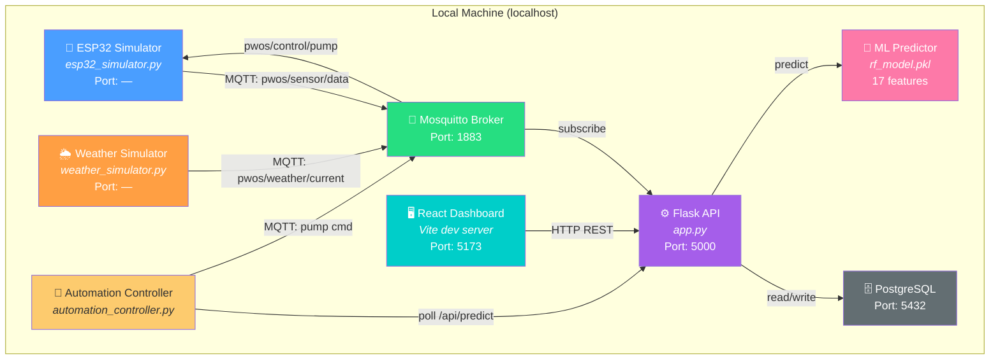
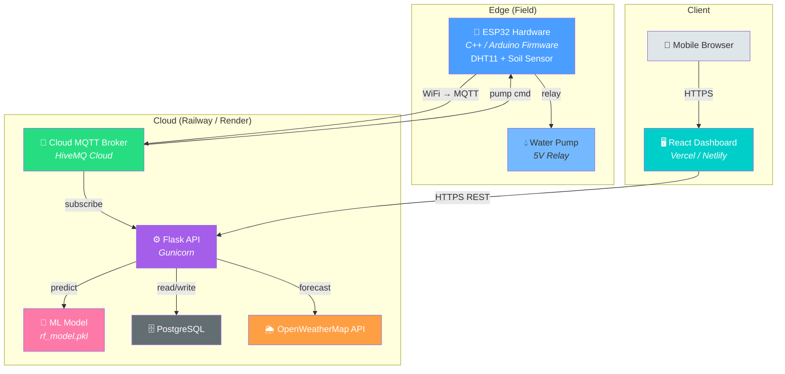

# P-WOS Project Overview

**Predictive Water Optimization System**

---

## Project Summary

| Attribute | Value |
|-----------|-------|
| **Domain** | AgriTech / IoT / Machine Learning |
| **Concept** | ML-driven smart irrigation using real-time sensor data |
| **Focus** | Full-stack application (embedded C++, cloud ML API, web dashboard) |
| **Hypothesis** | ≥15% water reduction vs. reactive threshold systems |
| **Result** | **16.7% validated** (93% ML accuracy) |

---

## Architecture Diagrams

### Local Development Setup

### Production Setup

### Manual ML Training Pipeline

```mermaid
graph LR
    subgraph "1. Data Collection"
        SIM2["ESP32 Simulator"]
        DB2["🗄️ PostgreSQL<br/><i>sensor_readings</i><br/><i>watering_events</i>"]
    end

    subgraph "2. Data Preparation"
        EXT["data_collector.py<br/><i>Extract + label</i>"]
        CSV["training_data.csv<br/><i>17 features + target</i>"]
    end

    subgraph "3. Model Training"
        TRAIN["train_model.py<br/><i>Random Forest</i><br/><i>80/20 split</i>"]
        EVAL["Evaluation<br/><i>Accuracy: 93%</i><br/><i>F1: 0.92</i>"]
    end

    subgraph "4. Deployment"
        PKL["rf_model.pkl"]
        META["model_metadata.json"]
        PRED["ml_predictor.py<br/><i>Loaded at API start</i>"]
    end

    SIM2 -- "2-4 weeks" --> DB2
    DB2 --> EXT
    EXT --> CSV
    CSV --> TRAIN
    TRAIN --> EVAL
    EVAL -- "if metrics OK" --> PKL
    TRAIN --> META
    PKL --> PRED
    META --> PRED

    style SIM2 fill:#4a9eff,color:#fff
    style DB2 fill:#636e72,color:#fff
    style EXT fill:#fdcb6e,color:#333
    style CSV fill:#ffeaa7,color:#333
    style TRAIN fill:#fd79a8,color:#fff
    style EVAL fill:#e17055,color:#fff
    style PKL fill:#a55eea,color:#fff
    style META fill:#dfe6e9,color:#333
    style PRED fill:#26de81,color:#fff
```

---

## Background & Problem Statement

- **Global Context:** Agriculture consumes ~70% of fresh water; up to 50% is wasted by timer-based irrigation.
- **Traditional Method:** Reactive threshold ("if moisture < 30%, pump ON") — ignores weather, time-of-day, and trends.
- **P-WOS Approach:** Time-series ML model predicts future soil moisture and proactively schedules watering, integrating local weather forecasts and VPD physics.

---

## Research Parameters

### Aim
Design, develop, and evaluate a predictive software architecture for a low-cost, IoT-enabled micro-irrigation system that uses ML to forecast water needs.

### Objectives
1. ESP32 firmware to sample and transmit soil moisture, temperature, and humidity via MQTT.
2. Cloud-based ML API to process sensor + weather data and host a water-need prediction model.
3. Control logic that schedules the pump based on model predictions over fixed thresholds.
4. Full-stack web dashboard for monitoring performance, water logs, and ML confidence.
5. Quantitative comparison: predictive vs. reactive water efficiency.

### Research Questions
1. How can an inexpensive classification model predict the Optimal Time to Water (OTW)?
2. What software architecture minimizes data latency and ensures reliable control?
3. By what percentage can P-WOS reduce water consumption over a two-week cycle?

### Hypothesis
> A time-series ML prediction model integrated into an IoT micro-irrigation system will achieve a minimum **15% reduction** in water consumption compared to a reactive threshold-based system.

---

## Significance & Scope

| Aspect | Detail |
|--------|--------|
| **Environmental** | Water conservation through intelligent, targeted irrigation |
| **Technological** | Edge Computing + Cloud ML for real-time control |
| **Economic** | Low-cost framework (~$60-80 hardware) with rapid ROI |
| **Academic** | Full-stack capstone: firmware → networking → cloud → frontend |

### Scope & Limitations
- **Boundary:** Single test bed (potted plant)
- **Data Sources:** Onboard sensors + OpenWeatherMap API
- **Exclusions:** Mechanical systems, pest detection
- **Assumptions:** Accurate sensors, stable Wi-Fi, homogeneous soil
- **Limitations:** Limited farm scalability, simplified ML (Random Forest), external power

---

## Key Terms

| Term | Definition |
|------|------------|
| **IoT** | Internet of Things — interconnected physical devices exchanging data |
| **MQTT** | Lightweight messaging protocol for low-bandwidth IoT networks |
| **ML** | Machine Learning — statistical methods to learn from data |
| **Reactive System** | Acts when a fixed threshold is crossed |
| **Predictive System** | Forecasts future states and acts proactively |
| **VPD** | Vapor Pressure Deficit — driver of plant evapotranspiration |
| **Time-Series Data** | Data points indexed in time order |

---

## Validated Results

| Metric | Target | Achieved | Status |
|--------|--------|----------|--------|
| Water Savings | ≥15% | **16.7%** | ✅ Validated |
| ML Accuracy | ≥85% | **93.06%** | ✅ Exceeded |
| F1-Score | ≥0.75 | **0.92** | ✅ Exceeded |
| ML Features | — | **17** | ✅ Enhanced |
