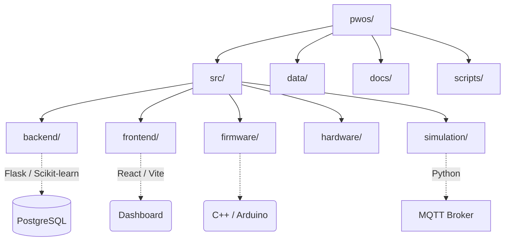

# Codebase Analysis: P-WOS (Predictive Watering Optimization System)

Based on a high-level review of the project directory structure, `README.md`, and core modules, here is an analysis of the P-WOS codebase.

## 🎯 Project Overview
P-WOS is a **Smart Irrigation Digital Twin with Machine Learning Control** designed to optimize agricultural or residential watering. It aims to reduce water consumption by leveraging predictive machine learning models rather than reactive, threshold-based watering schedules. 

The system operates across several tiers, including a physical/simulated edge device (ESP32), a message broker (MQTT), a Python backend running AI/ML inferences, and a React frontend for real-time monitoring and control.

---

## 🏛️ System Architecture & Tech Stack

### 1. Edge / IoT Layer (`src/firmware`, `src/hardware`, `src/simulation`)
*   **Firmware (C++ / Arduino)**: Production ESP32 firmware (`pwos_esp32.ino`) handles sensor reading (DHT11 temperature/humidity, resistive soil moisture), pump actuation via relay, and MQTT communication. Includes MQTT Last Will and Testament (LWT) for hardware status tracking — publishes `ONLINE` on connect, broker auto-publishes `OFFLINE` on unexpected disconnect.
*   **Hardware Bridge**: `serial_bridge.py` enables USB-mode operation where the ESP32 outputs JSON on serial and the PC bridges it to MQTT.
*   **Simulation**: When hardware is unavailable, the system runs a software digital twin (`esp32_simulator.py`) which publishes mock sensor data. It includes a `weather_simulator.py` to generate realistic environmental parameters like VPD (Vapor Pressure Deficit) and simulate rainfall.

### 2. Messaging Layer (`Mosquitto`)
*   The project utilizes **MQTT (Mosquitto)** to enable real-time, lightweight communication between the IoT devices (or simulators) and the backend API.
*   **Key Topics**:
    - `pwos/sensor/data` — JSON sensor telemetry (soil moisture, temperature, humidity)
    - `pwos/control/pump` — JSON pump commands (`{"action": "ON", "duration": 30}`)
    - `pwos/system/hardware` — Plain text `ONLINE` / `OFFLINE` (retained, with LWT)
    - `pwos/system/mode` — Plain text `AUTO` / `MANUAL` (retained)
    - `pwos/weather/current` — JSON weather data (real or simulated)
    - `pwos/device/status` — JSON heartbeat (uptime, heap, RSSI)

### 3. Backend & ML Layer (`src/backend`)
*   **Tech Stack**: Python (3.13+), Flask, **PostgreSQL** (via psycopg2), Scikit-Learn (`sklearnex` for Intel iGPU acceleration)
*   **Core Responsibilities**:
    *   **Flask API (`app.py`)**: Exposes REST endpoints for the frontend. **Integrates the MQTT subscriber directly** — the `on_message` handler routes plain-text topics (mode, hardware) before attempting JSON parsing for sensor/weather topics.
    *   **Database (`database.py`)**: PostgreSQL persistence using psycopg2 with parameterized queries and connection pooling.
    *   **Automation Controller (`automation_controller.py`)**: Interprets incoming sensor values to trigger watering via polling the predict endpoint.
    *   **AI/ML Service (`ai_service/`)**: Houses a Random Forest ML model trained on historical data with 17 features. The model leverages external weather forecasting (`weather_api.py`) to preemptively decide if watering is needed or if rainfall will suffice.

### 4. Frontend Layer (`src/frontend`)
*   **Tech Stack**: React 19, Vite, TypeScript, Vanilla CSS
*   **UI Components**: Utilizes `@radix-ui` primitives, `lucide-react` for icons, `framer-motion` for animations, and `recharts` for data visualization.
*   **Core Responsibilities**: Provides a real-time dashboard with live WebSocket data (via `useMqtt` hook), system health monitoring, historical analytics with gap-aware KPI calculations, and manual overrides for pump control and system mode.

---

## 📁 Directory Structure Breakdown

### Notable Subdirectories
*   **`src/backend/`**: Contains the `app.py` web server setup (with integrated MQTT subscriber), `models/` for saved ML models, `ai_service/` for ML predictions, and `weather_api.py`.
*   **`src/frontend/`**: Contains the React dashboard. It relies on Vite as a bundler and Playwright (`e2e/`) / Vitest for testing.
*   **`src/firmware/`**: Contains the production ESP32 firmware (`pwos_esp32/pwos_esp32.ino`) with WiFi, MQTT, LWT, sensor reading, and pump control logic.
*   **`data/`**: Used for storing raw/processed datasets for ML model training, historical sensor data, and calibration information. 
*   **`docs/`**: Includes detailed architectural reference materials (e.g., `API_REFERENCE.md`, `DATABASE_GUIDE.md`, etc.).

---

## 🔍 Key Observations & Execution

1.  **A/B Testing Native**: The system specifically embeds logic to test water savings against a baseline hypothesis (validated at 16.7% savings in your simulation runs). 
2.  **Hardware & Software Bridging**: The repository is set up gracefully so that users can replace the simulated Python ESP32 script with actual microcontroller hardware with almost zero friction (just swapping MQTT targets or using the `serial_bridge`). The firmware includes LWT for automatic online/offline detection.
3.  **Clean Separation of Concerns**: By using MQTT as a middleman, the heavy AI workloads (Random Forest in Python) are cleanly decoupled from the edge devices, preventing performance constraints on the microcontroller.
4.  **MQTT Message Routing**: The backend's `on_message` handler is structured to process plain-text topics (hardware status, system mode) before attempting JSON parsing, preventing crashes from non-JSON payloads.
5.  **Gap-Aware Analytics**: The frontend analytics engine uses null-value gap filling with timestamp snapping to accurately display KPIs without inflating or deflating averages from missing data periods.
