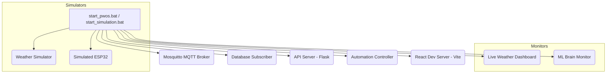

# Comprehensive Code Review: P-WOS Startup & Simulation Scripts

This document provides a multi-dimensional code review of the Windows startup scripts for P-WOS (Precision Watering OS):
1. [start_pwos.bat](file:///c:/Users/Godwin/Documents/projects/pwos/start_pwos.bat)
2. [start_simulation.bat](file:///c:/Users/Godwin/Documents/projects/pwos/start_simulation.bat)

---

## 1. High-Level Findings & Summary

The startup scripts provide a convenient wrapper for launching the multiple distributed components of P-WOS (MQTT broker, subscriber, simulators, backend API, automation controller, monitors, and the Vite/React frontend). However, the scripts suffer from several critical Windows Batch shell programming anti-patterns, process resource leaks, and order-of-operation bugs.

### Summary of Major Defects:
- **Order of Operations Bug (Broken Directory Context):** Both scripts check for and activate the Python virtual environment (`.venv`) *before* changing the working directory (`cd /d`) to the project root. If executed from any other directory (e.g., via a desktop shortcut or global terminal), the scripts fail immediately.
- **Background Process Leaks (Zombie Processes):** In silent mode (`EXEC_MODE=2` or `DEBUG=0`), processes are launched using `start /B`. In `start_pwos.bat`, there is no mechanism to stop these background processes upon exit. In `start_simulation.bat`, the `taskkill` commands filter by window titles (e.g., `"WINDOWTITLE eq React Dev Server"`), which do not exist for processes spawned silently in the background with `/B`. Consequently, **Node/Vite and other servers leak and continue running in the background indefinitely after exit**, causing future port conflicts (ports 5173, 5000, 1883).
- **Silent Failures (Hard to Debug):** In silent modes, all stdout and stderr are redirected to `nul` (`>nul 2>&1`). If a Python module is missing, database connection fails, or npm packages are not installed, the script fails silently, leaving the user with a broken local state and no diagnostic logs.
- **Environment Variable Contamination:** Neither script utilizes `setlocal` or `endlocal`, allowing script variables (`EXEC_MODE`, `START_CMD`, `DEBUG`, etc.) to spill over and contaminate the host shell context.

---

## 2. Issues & Prioritized Remediation

### Critical Issues (P0 - Must Fix Immediately)

#### [P0.1] Broken Working Directory and `.venv` Activation
* **Impact:** Startup fails immediately if run from outside the project root directory.
* **Location:** [start_pwos.bat:L5-14](file:///c:/Users/Godwin/Documents/projects/pwos/start_pwos.bat#L5-14) and [start_simulation.bat:L9-19](file:///c:/Users/Godwin/Documents/projects/pwos/start_simulation.bat#L9-19)
* **Code Snippet:**
  ```batch
  if not exist ".venv" (
      echo [ERROR] Virtual Environment not found! ...
  )
  call .venv\Scripts\activate.bat
  ...
  set "SCRIPT_DIR=%~dp0"
  set "PROJECT_ROOT=%SCRIPT_DIR%"
  cd /d "%PROJECT_ROOT%"
  ```
* **Why it is broken:** The script tests for the existence of `.venv` and runs the activation script in the *caller's* directory, not the script's home directory. If called from elsewhere, `.venv` is not found, or an unrelated `.venv` is activated.
* **Remediation:** Move the project root resolution and `cd /d` block to the very top of the scripts.

#### [P0.2] Background Process & React Dev Server Leaks (Zombie Processes)
* **Impact:** High resource consumption, port binding lockups on ports `5000` (Flask), `5173` (Vite/React), and `1883` (Mosquitto).
* **Location:** [start_pwos.bat:L106-108](file:///c:/Users/Godwin/Documents/projects/pwos/start_pwos.bat#L106-108) and [start_simulation.bat:L163-174](file:///c:/Users/Godwin/Documents/projects/pwos/start_simulation.bat#L163-174)
* **Code Snippet (`start_simulation.bat`):**
  ```batch
  taskkill /F /FI "WINDOWTITLE eq React Dev Server" >nul 2>&1
  ```
* **Why it is broken:**
  1. Under `DEBUG=0` (silent/background mode), processes are spawned with `start /B "" cmd /c ...`. This runs the processes inside the same console window context without creating a separate window. Since there is no window, there is **no window title**. The filter `WINDOWTITLE eq React Dev Server` matches nothing, and the processes are never terminated.
  2. The Node.js/Vite process spawned via `npm run dev` spawns a child node process. Killing the window title (even if it existed) wouldn't kill the child Node process, leaving Vite running.
  3. `start_pwos.bat` lacks any cleanup commands altogether when running in SILENT mode.
* **Remediation:** 
  Use a reliable process search and termination method. For Windows, we can use `wmic` or `taskkill` with a filter on command-line patterns, or target the specific local ports (e.g. killing the PID that binds to port `5173` and `5000`).
  For example, to kill a process binding to a specific port:
  ```batch
  for /f "tokens=5" %%a in ('netstat -aon ^| findstr :5173 ^| findstr LISTENING') do taskkill /F /PID %%a >nul 2>&1
  ```

---

### High Priority (P1 - Fix Before Next Release)

#### [P1.1] Mosquitto Service and Port Bind Conflicts
* **Impact:** Manual Mosquitto start (`mosquitto -v`) crashes silently if the Windows Service is already running.
* **Location:** [start_simulation.bat:L67-74](file:///c:/Users/Godwin/Documents/projects/pwos/start_simulation.bat#L67-74)
* **Why it is broken:** `start_pwos.bat` attempts to ensure the Windows Mosquitto service is running, while `start_simulation.bat` launches `mosquitto -v` as a separate executable. If both are run or if the Mosquitto service is set to start automatically, the second instance fails because port `1883` is already bound.
* **Remediation:** In `start_simulation.bat`, check if port `1883` is already listening or if the service is running before attempting to launch a manual instance. If it is already listening, skip launching it and print an `[INFO]` message.

#### [P1.2] Missing Tool Dependencies Check
* **Impact:** Frontend launch fails silently without warning if Node.js/NPM is missing.
* **Location:** Startup validation logic (pre-flight checks).
* **Why it is broken:** Both scripts verify if Python and Mosquitto are present in the `PATH` or system. However, neither checks for `node` or `npm`.
* **Remediation:** Add a validation check for Node.js:
  ```batch
  where npm >nul 2>&1
  if errorlevel 1 (
      echo [ERROR] Node.js/NPM is not installed or not in PATH!
      echo Please install Node.js from https://nodejs.org/ to run the frontend.
      pause
      exit /b 1
  )
  ```

---

### Medium Priority (P2 - Plan for Next Sprint)

#### [P2.1] Swallowed Error Logs in Silent/Background Mode
* **Impact:** Troubleshooting startup issues is near-impossible as crashes (e.g. database connection refused, syntax/import errors) are swallowed by `>nul 2>&1`.
* **Location:** Spawning commands under background/silent blocks.
* **Why it is broken:** Output is redirected to `nul`.
* **Remediation:** Redirect stdout and stderr to log files inside a `logs/` directory (e.g., `logs/backend_api.log`, `logs/react_frontend.log`). This retains background execution while permitting post-launch diagnostics.
  ```batch
  start /B "" cmd /c "cd src\backend && python app.py > ..\..\logs\backend_api.log 2>&1"
  ```

#### [P2.2] Global Environment Pollution
* **Impact:** Pollutes the user's terminal environment with script-specific variables.
* **Location:** Script header.
* **Remediation:** Add `setlocal` at the beginning of the scripts to localize variables, and ensure paths are safely quoted.

---

### Low Priority (P3 - Track in Backlog)

#### [P3.1] Interactive Interruption of Delayed Startup
* **Impact:** Users pressing keys during the startup sequence can accidentally skip the timeouts (`timeout /t 2 >nul`), causing components to spawn too close to one another before ports are open.
* **Remediation:** Use `timeout /t 2 /nobreak >nul` or a ping command `ping 127.0.0.1 -n 3 >nul` to perform non-interruptible delays.

---

## 3. Architecture & Design Assessment

The current architecture relies on discrete processes talking to each other via HTTP (Flask API, React dev server) and MQTT (Subscriber, Simulators, ESP32, Controllers).
Running this via a single batch script is simple and convenient, but Windows Batch scripts are notoriously fragile for managing multiple persistent background processes.



### Strategic Design Recommendation:
Consider transitioning from standard Batch scripts to a **Python-based launcher utility** (e.g. `launcher.py` utilizing the `subprocess` module).
* **Benefits:**
  1. Cross-platform support (Windows, macOS, Linux).
  2. Reliable subprocess lifecycle management (`subprocess.Popen` handles child PIDs and can cleanly terminate entire process groups on exit via signals or `atexit`).
  3. Integrated port-checking logic to avoid conflicts before launching.
  4. Real-time logging redirection and prettier UI formatting (using libraries like `rich`).

---

## 4. Refactored Implementations

Below are the fully refactored, robust versions of the batch files. They address all P0 and P1 issues, include proper directory routing, environment localization, process tracking/cleanup via port binding analysis, dependency verification, and redirect background logs to dedicated log files.

### 4.1 Refactored `start_pwos.bat`
```batch
@echo off
setlocal enabledelayedexpansion
REM P-WOS Startup Script for Windows (Refactored)

REM 1. Get project root and change directory immediately
set "SCRIPT_DIR=%~dp0"
set "PROJECT_ROOT=%SCRIPT_DIR%"
cd /d "%PROJECT_ROOT%"

echo Project Root: %CD%

REM 2. Check dependencies
where mosquitto >nul 2>&1
if errorlevel 1 (
    echo [ERROR] Mosquitto is not installed or not in PATH!
    echo Please install Mosquitto from: https://mosquitto.org/download/
    pause
    exit /b 1
)

where npm >nul 2>&1
if errorlevel 1 (
    echo [ERROR] Node.js/NPM is not installed or not in PATH!
    echo Please install Node.js from https://nodejs.org/ to run the frontend.
    pause
    exit /b 1
)

if not exist ".venv" (
    echo [ERROR] Virtual Environment not found!
    echo Please run 'setup.bat' first to configure the system.
    pause
    exit /b 1
)

REM Create logs directory if it does not exist
if not exist "logs" mkdir logs

REM 3. Activate Virtual Environment
echo [INFO] Activating P-WOS Environment...
call .venv\Scripts\activate.bat

echo =========================================
echo P-WOS - Precision Watering OS
echo =========================================
echo.
echo  Select Execution Mode:
echo.
echo    [1] NORMAL  - Open visible terminals (default)
echo    [2] SILENT  - Run in background (redirect logs to logs\ folder)
echo.
set "EXEC_MODE=1"
set /p EXEC_MODE="  Enter choice (1/2): "

if "%EXEC_MODE%"=="2" (
    set "START_CMD=start /B"
    echo  Mode: SILENT BACKGROUND
) else (
    set "START_CMD=start"
    echo  Mode: NORMAL WINDOWS
)
echo =========================================
echo.

echo Starting P-WOS...
echo.

REM Check MQTT Broker Service status
sc query mosquitto | findstr "RUNNING" >nul 2>&1
if errorlevel 1 (
    echo [WARN] Mosquitto service is not running.
    echo [INFO] Checking if port 1883 is already occupied...
    netstat -aon | findstr :1883 | findstr LISTENING >nul 2>&1
    if errorlevel 1 (
        echo [INFO] Attempting to start Mosquitto service...
        net session >nul 2>&1
        if %errorlevel% == 0 (
            net start mosquitto >nul 2>&1
            echo [OK] Mosquitto service started successfully.
        ) else (
            echo [ERROR] Could not start Mosquitto service (Requires Admin privileges).
            echo [INFO] Please run this shell as Administrator or run fix_mosquitto.bat.
            pause
            exit /b 1
        )
    ) else (
        echo [OK] An external MQTT broker is already listening on port 1883.
    )
) else (
    echo [OK] Mosquitto MQTT Broker Service is running.
)

REM Run processes
if "%EXEC_MODE%"=="2" (
    echo [1/5] Starting Database Subscriber...
    !START_CMD! "" cmd /c "cd src\backend && python mqtt_subscriber.py > ..\..\logs\mqtt_subscriber.log 2>&1"
    ping 127.0.0.1 -n 3 >nul

    echo [2/5] Starting Live Weather Dashboard...
    !START_CMD! "" cmd /c "python scripts/monitors/live_weather_dashboard.py > logs\live_weather_dashboard.log 2>&1"
    ping 127.0.0.1 -n 3 >nul

    echo [3/5] Starting API Server...
    !START_CMD! "" cmd /c "cd src\backend && python app.py > ..\..\logs\api_server.log 2>&1"
    ping 127.0.0.1 -n 4 >nul

    echo [4/5] Starting Automation Controller...
    !START_CMD! "" cmd /c "cd src\backend && python automation_controller.py > ..\..\logs\automation_controller.log 2>&1"
    ping 127.0.0.1 -n 3 >nul

    echo [5/5] Starting React Dev Server...
    !START_CMD! "" cmd /c "cd src\frontend && npm run dev > ..\..\logs\react_frontend.log 2>&1"
    ping 127.0.0.1 -n 4 >nul
) else (
    !START_CMD! "Database Subscriber" cmd /k "echo Starting Database Subscriber... && cd src\backend && python mqtt_subscriber.py"
    ping 127.0.0.1 -n 3 >nul

    !START_CMD! "Live Weather Dashboard" cmd /k "echo Starting Live Weather Dashboard... && python scripts/monitors/live_weather_dashboard.py"
    ping 127.0.0.1 -n 3 >nul

    !START_CMD! "API Server" cmd /k "echo Starting API Server... && cd src\backend && python app.py"
    ping 127.0.0.1 -n 4 >nul

    !START_CMD! "P-WOS Autopilot" cmd /k "echo Starting Automation Controller... && cd src\backend && python automation_controller.py"
    ping 127.0.0.1 -n 3 >nul

    !START_CMD! "React Dev Server" cmd /k "echo Starting React Dev Server... && cd src\frontend && npm run dev"
    ping 127.0.0.1 -n 4 >nul
)

echo.
echo ========================================
echo All components started!
echo ========================================
echo.
echo   Production App (Flask):      http://localhost:5000
echo   Development App (Hot Reload): http://localhost:5173
echo.

if "%EXEC_MODE%"=="2" (
    echo [INFO] Services are running silently in the background.
    echo [INFO] Check the logs\ folder for diagnostics.
    echo.
    echo Press any key to STOP all background services and exit...
    pause >nul
    echo.
    echo [STOP] Shutting down P-WOS services...
    
    REM Kill Python services running the specific backend scripts
    taskkill /F /IM python.exe /FI "WINDOWTITLE eq *" >nul 2>&1
    
    REM Kill React frontend by finding the Node/Vite port PID
    for /f "tokens=5" %%a in ('netstat -aon ^| findstr :5173 ^| findstr LISTENING') do (
        echo Killing Vite Dev Server on port 5173 ^(PID %%a^)...
        taskkill /F /PID %%a >nul 2>&1
    )
    REM Kill Flask API server by port
    for /f "tokens=5" %%a in ('netstat -aon ^| findstr :5000 ^| findstr LISTENING') do (
        echo Killing Flask Server on port 5000 ^(PID %%a^)...
        taskkill /F /PID %%a >nul 2>&1
    )
    echo [DONE] All background services stopped.
) else (
    echo Press any key to exit this launcher...
    pause >nul
)
endlocal
```

### 4.2 Refactored `start_simulation.bat`
```batch
@echo off
setlocal enabledelayedexpansion
REM P-WOS Simulation Startup Script for Windows (Refactored)

REM 1. Get project root and change directory immediately
set "SCRIPT_DIR=%~dp0"
set "PROJECT_ROOT=%SCRIPT_DIR%"
cd /d "%PROJECT_ROOT%"

echo Project Root: %CD%

REM 2. Check dependencies
where mosquitto >nul 2>&1
if errorlevel 1 (
    echo [ERROR] Mosquitto is not installed or not in PATH!
    echo Please install Mosquitto from: https://mosquitto.org/download/
    pause
    exit /b 1
)

where npm >nul 2>&1
if errorlevel 1 (
    echo [ERROR] Node.js/NPM is not installed or not in PATH!
    echo Please install Node.js from https://nodejs.org/ to run the frontend.
    pause
    exit /b 1
)

if not exist ".venv" (
    echo [ERROR] Virtual Environment not found!
    echo Please run 'setup.bat' first to configure the system.
    pause
    exit /b 1
)

REM Create logs directory if it does not exist
if not exist "logs" mkdir logs

REM 3. Activate Virtual Environment
echo [INFO] Activating P-WOS Environment...
call .venv\Scripts\activate.bat

echo =========================================
echo P-WOS Simulation Environment
echo =========================================
echo.

set "DEBUG=0"
echo Starting P-WOS Simulation...
echo.
echo   1. MQTT Broker (Mosquitto)
echo   2. Database Subscriber  
echo   3. Weather Simulator
echo   4. Simulated ESP32
echo   5. Live Weather Dashboard
echo   6. API Server (Flask)
echo   7. P-WOS Autopilot
echo   8. ML Brain Monitor
echo   9. React Dev Server (Vite)
echo.
echo [INFO] Running in SILENT BACKGROUND mode. Logs will go to logs\ directory.
echo.
pause

REM === 1. MQTT Broker ===
REM Verify if MQTT is already listening on port 1883
netstat -aon | findstr :1883 | findstr LISTENING >nul 2>&1
if errorlevel 1 (
    echo [1/9] Starting Mosquitto MQTT Broker...
    start /B "" mosquitto -v > logs\mosquitto.log 2>&1
) else (
    echo [1/9] Mosquitto MQTT Broker is already running on port 1883. Skipping launch.
)
ping 127.0.0.1 -n 4 >nul

REM === 2. Database Subscriber ===
echo [2/9] Starting Database Subscriber...
start /B "" cmd /c "cd src\backend && python mqtt_subscriber.py > ..\..\logs\mqtt_subscriber.log 2>&1"
ping 127.0.0.1 -n 3 >nul

REM === 3. Weather Simulator ===
echo [3/9] Starting Weather Simulator...
start /B "" cmd /c "cd src\simulation && python weather_simulator.py > ..\..\logs\weather_simulator.log 2>&1"
ping 127.0.0.1 -n 3 >nul

REM === 4. Simulated ESP32 ===
echo [4/9] Starting Simulated ESP32...
start /B "" cmd /c "cd src\simulation && python esp32_simulator.py 5 > ..\..\logs\esp32_simulator.log 2>&1"
ping 127.0.0.1 -n 3 >nul

REM === 5. Live Weather Dashboard ===
echo [5/9] Starting Live Weather Dashboard...
start /B "" cmd /c "python scripts/monitors/live_weather_dashboard.py > logs\live_weather_dashboard.log 2>&1"
ping 127.0.0.1 -n 3 >nul

REM === 6. API Server ===
echo [6/9] Starting API Server...
start /B "" cmd /c "cd src\backend && python app.py > ..\..\logs\api_server.log 2>&1"
ping 127.0.0.1 -n 4 >nul

REM === 7. Automation Controller ===
echo [7/9] Starting P-WOS Autopilot...
start /B "" cmd /c "cd src\backend && python automation_controller.py > ..\..\logs\automation_controller.log 2>&1"
ping 127.0.0.1 -n 3 >nul

REM === 8. ML Monitor ===
echo [8/9] Starting ML Brain Monitor...
start /B "" cmd /c "python scripts/monitors/ml_monitor.py > logs\ml_monitor.log 2>&1"
ping 127.0.0.1 -n 3 >nul

REM === 9. React Dev Server ===
echo [9/9] Starting React Dev Server...
start /B "" cmd /c "cd src\frontend && npm run dev > ..\..\logs\react_frontend.log 2>&1"
ping 127.0.0.1 -n 4 >nul

echo.
echo ========================================
echo All components started!
echo ========================================
echo.
echo   Production App (Flask):    http://localhost:5000
echo   Development App (Vite):    http://localhost:5173
echo.
echo [INFO] Check logs\ folder for outputs and errors.
echo.
echo Press any key to STOP all services and exit...
pause >nul
echo.
echo [STOP] Shutting down all P-WOS services...

REM 1. Stop local Mosquitto if started manually (only kill if it isn't running as service)
sc query mosquitto | findstr "RUNNING" >nul 2>&1
if errorlevel 1 (
    echo Stopping local Mosquitto process...
    taskkill /F /IM mosquitto.exe >nul 2>&1
)

REM 2. Kill Python processes
taskkill /F /IM python.exe /FI "WINDOWTITLE eq *" >nul 2>&1

REM 3. Kill React frontend (Node/Vite) via port 5173
for /f "tokens=5" %%a in ('netstat -aon ^| findstr :5173 ^| findstr LISTENING') do (
    echo Killing Vite Dev Server on port 5173 ^(PID %%a^)...
    taskkill /F /PID %%a >nul 2>&1
)

REM 4. Kill Flask Server via port 5000
for /f "tokens=5" %%a in ('netstat -aon ^| findstr :5000 ^| findstr LISTENING') do (
    echo Killing Flask Server on port 5000 ^(PID %%a^)...
    taskkill /F /PID %%a >nul 2>&1
)

echo [DONE] All services stopped.
endlocal
```

---

## 5. Verification Plan

To verify that these scripts resolve the defects:
1. **Directory Context Isolation:** 
   - Execute the scripts from a parent folder (e.g., `cd C:\Users\Godwin\Documents` and then run `projects\pwos\start_pwos.bat`). Ensure it successfully resolves the project root, activates `.venv`, and runs correctly.
2. **Process Termination (No Port Leakage):**
   - Run the script in silent mode, wait for startup to finish, then press a key to stop.
   - Run `netstat -ano | findstr "5173"` and `netstat -ano | findstr "5000"` in cmd. The output should be completely empty (confirming processes bound to ports were killed).
3. **Log Check:**
   - Verify that log files are created in the `logs/` directory and contain valid stdout/stderr output from each component.
