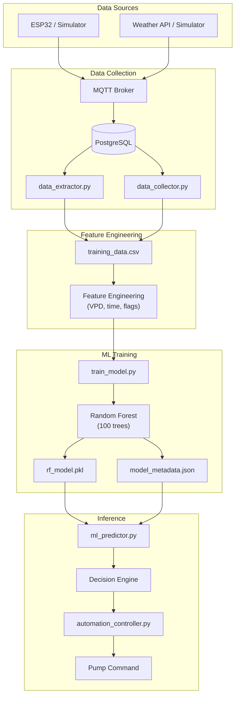
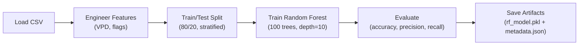
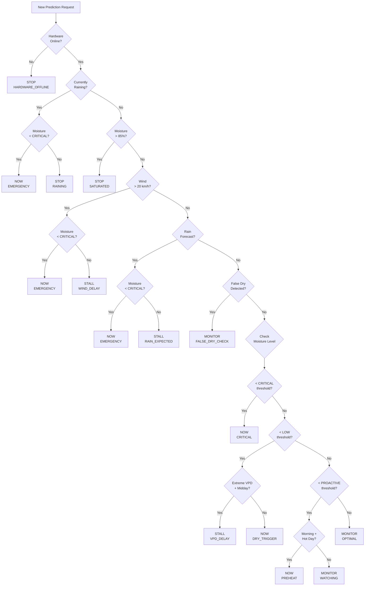
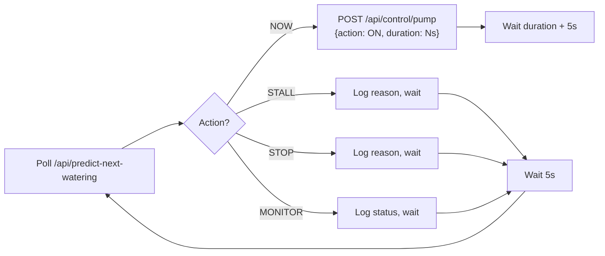
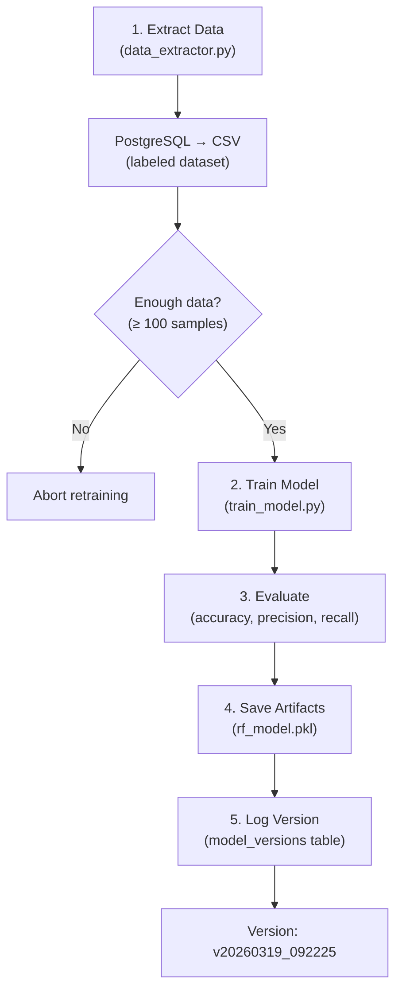

# ML Model Guide

**P-WOS Machine Learning — How the System Thinks**

---

## Overview

P-WOS uses a **Random Forest Classifier** to predict whether a plant will need watering in the next 24 hours. The model is **crop-aware and region-aware** — it includes agronomic parameters for 5 Zimbabwean crops across 3 agro-ecological regions. It works alongside a rule-based **Decision Engine** that converts raw ML predictions into actionable pump commands (NOW, STALL, STOP, MONITOR).

```
┌─────────────────────────────────────────────────────────────────┐
│                     P-WOS AI PIPELINE (v3.0)                     │
│                                                                 │
│  Sensors + Crop   Features  ML Model  Decision Engine Pump Action │
│  & Region Info    → 12 feat  → RF       → Rule-Based    → NOW/STALL/ │
│                            630k samp  (VPD + Weather)   STOP/MONITOR │
└─────────────────────────────────────────────────────────────────┘
```

### Current Model Performance

| Metric | Value |
|--------|-------|
| **Accuracy** | 83.43% |
| **Precision** (Class 1) | 96% |
| **Recall** (Class 1) | 72% |
| **F1-Score** (Class 1) | 82% |
| **Model Type** | RandomForestClassifier |
| **Estimators** | 100 trees, max_depth=10 |
| **Training Samples** | 504,000 (80% of 630k) |
| **Testing Samples** | 126,000 (20% of 630k) |
| **Model Size** | ~2.3 MB (`rf_model.pkl`) |

---

## Architecture



---

## The 4-Phase ML Pipeline

### Phase 1: Data Collection

Data flows from sensors through MQTT into PostgreSQL, then gets extracted into CSV for training.

```
ESP32/Simulator → MQTT → app.py (on_message) → PostgreSQL
                                                    ↓
                                            data_extractor.py
                                                    ↓
                                         real_training_data.csv
```

#### Two Data Collection Paths

| Path | File | Source | Use Case |
|------|------|--------|----------|
| **Legacy** | `data_collector.py` | SQLite simulation DB | Initial training with synthetic data |
| **Production** | `data_extractor.py` | PostgreSQL live DB | Retraining with real sensor data |

#### Labeling Strategy

The labeling logic creates the target variable `needs_watering_soon`:

```python
# data_extractor.py — Production labeling
LOOKBACK_WINDOW = 2 hours

For each watering event:
    Label all readings within 2 hours BEFORE the event as 1
    All other readings = 0
```

```python
# data_collector.py — Legacy labeling  
LOOKAHEAD_WINDOW = 24 hours

For each sensor reading:
    If watering happened within 24 hours AFTER this reading → label = 1
    Otherwise → label = 0
```

---

### Phase 2: Feature Engineering

The model uses **12 features** (9 original + 3 new crop/region context features):

#### Feature Table

| # | Feature | Type | Source | Description |
|---|---------|------|--------|-------------|
| 1 | `soil_moisture` | float | Sensor | Current soil moisture (0–100%) |
| 2 | `temperature` | float | Sensor | Air temperature (°C) |
| 3 | `humidity` | float | Sensor | Relative humidity (0–100%) |
| 4 | `wind_speed` | float | Weather | Wind speed (km/h) |
| 5 | `rain_intensity` | float | Weather | Current rain intensity |
| 6 | `vpd` | float | **Calculated** | Vapor Pressure Deficit (kPa) |
| 7 | `is_extreme_vpd` | binary | **Calculated** | 1 if VPD > 2.0 kPa (heatwave) |
| 8 | `is_raining` | binary | **Calculated** | 1 if rain_intensity > 0 |
| 9 | `is_high_wind` | binary | **Calculated** | 1 if wind_speed > 20 km/h |
| 10 | `crop_target_moisture` | float | **Settings** | Active crop's optimal moisture % |
| 11 | `crop_critical_moisture` | float | **Settings** | Active crop's critical low moisture % |
| 12 | `region_evap_multiplier` | float | **Settings** | Evaporation multiplier for resolved region |

#### VPD Calculation (Tetens Formula)

VPD (Vapor Pressure Deficit) measures the "drying power" of the air — higher VPD means faster evaporation.

```python
# Saturation vapor pressure (kPa)
es = 0.6108 × exp((17.27 × T) / (T + 237.3))

# Actual vapor pressure (kPa)
ea = es × (RH / 100)

# Vapor Pressure Deficit
VPD = max(0, es - ea)
```

| VPD Range | Condition | Plant Impact |
|-----------|-----------|-------------|
| 0.0–0.4 kPa | Very humid | Minimal transpiration |
| 0.4–0.8 kPa | Ideal | Healthy transpiration |
| 0.8–1.2 kPa | Moderate stress | Increased water demand |
| 1.2–2.0 kPa | High stress | Rapid drying |
| > 2.0 kPa | **Extreme** (heatwave) | Stomata close, risk of damage |

#### Additional Inference-Only Features

The predictor also calculates these features at inference time for the Decision Engine (not used by the Random Forest model directly):

| Feature | Description | Used By |
|---------|-------------|---------|
| `hour` | Current hour (0–23) | Decision Engine (timing) |
| `day_of_week` | Day of week (0–6) | Decision Engine |
| `is_daytime` | 1 if 6:00–18:00 | Decision Engine |
| `is_hot_hours` | 1 if 10:00–16:00 | Decision Engine (VPD delay) |
| `forecast_minutes` | Minutes until next rain | Rain confidence logic |
| `moisture_change_rate` | %/hour change | Decay rate estimation |
| `moisture_rolling_6` | 6-reading rolling avg | Trend smoothing |
| `temp_rolling_6` | 6-reading rolling avg | Trend smoothing |

---

### Phase 3: Training

```bash
python src/backend/models/train_model.py
```

#### Training Process



#### Hyperparameters

```python
RandomForestClassifier(
    n_estimators=100,       # 100 decision trees
    max_depth=10,           # Max tree depth (prevents overfitting)
    random_state=42,        # Reproducible results
    class_weight='balanced', # Handles class imbalance
    n_jobs=-1               # Use all CPU cores
)
```

#### Why Random Forest?

| Consideration | Random Forest | Neural Network | Linear Model |
|---------------|---------------|----------------|--------------|
| **Training data needed** | ~1,000+ samples ✅ | ~100,000+ | ~500+ |
| **Interpretability** | Feature importances ✅ | Black box ❌ | Coefficients |
| **Handles nonlinear** | Yes ✅ | Yes | No ❌ |
| **Overfitting risk** | Low (ensemble) ✅ | High | Low |
| **Inference speed** | Fast ✅ | Slower | Fastest |
| **Handles missing data** | Graceful ✅ | Needs imputation | Needs imputation |

#### Output Artifacts

| File | Location | Contents |
|------|----------|----------|
| `rf_model.pkl` | `src/backend/models/artifacts/` | Serialized scikit-learn model (~2.3 MB) |
| `model_metadata.json` | `src/backend/models/artifacts/` | Accuracy, feature list, metrics, timestamp, crop coverage |

---

## Crop Agronomic Profiles

The model includes the following crop profiles for Zimbabwe:

| Crop | Target Moisture | Critical | Low | Proactive | High/Sat | Evap Mult |
|------|:-:|:-:|:-:|:-:|:-:|:-:|
| **Maize** | 60% | 30% | 45% | 55% | 75% | 1.0× |
| **Potatoes** | 70% | 45% | 55% | 65% | 85% | 1.4× |
| **Tomatoes** | 62% | 35% | 48% | 58% | 75% | 1.2× |
| **Onions** | 65% | 40% | 52% | 60% | 80% | 0.8× |
| **Sorghum** | 50% | 20% | 30% | 40% | 65% | 0.6× |

Dynamic re-labeling: a soil moisture of 35% labels Sorghum as comfortable (`needs_watering_soon=0`) but Potatoes as critically dry (`needs_watering_soon=1`).

## Regional Evaporation Multipliers

| Region | Representative City | Evap Multiplier | Lat/Lon Bounds |
|--------|--------------------|-----------------|-|
| **Matabeleland** | Bulawayo | 1.5× (semi-arid) | -22.5 to -19.0 / 25.0 to 30.0 |
| **Mashonaland** | Harare | 1.0× (sub-humid) | Default |
| **Manicaland** | Mutare | 0.6× (humid-cool) | -21.0 to -17.5 / 32.0 to 34.0 |

Regional CSVs (15-day hourly from Visual Crossing API) are merged into the training dataset by `data_extractor.py`.

---

### Phase 4: Inference & Decision Engine

```bash
# API endpoint
GET /api/predict-next-watering
```

The prediction pipeline runs in two stages:

```
Stage 1: ML Prediction (Random Forest)
  Input: 12 features (9 sensor/physics + 3 crop/region) → Model → probability(needs_watering)

Stage 2: Decision Engine (Rule-Based)
  Input: ML output + environment + crop thresholds → Action
```

> **In-memory settings injection**: `app.py` passes pre-loaded settings to `ml_predictor.py` directly, completely eliminating disk I/O on every prediction call.

---

## Decision Engine (Detailed)

The Decision Engine converts the ML prediction into one of **4 actions**:

### Action Types

| Action | Meaning | Pump |
|--------|---------|------|
| **NOW** | Water immediately | ✅ ON |
| **STALL** | Delay watering (wait for rain, VPD, wind) | ❌ OFF |
| **STOP** | Do not water (raining, saturated) | ❌ OFF |
| **MONITOR** | All good, keep watching | ❌ OFF |

### Decision Flow



### Seasonal Thresholds (Zimbabwe / Southern Hemisphere)

```python
# Adjusted by month — higher thresholds in summer when evaporation is faster

Summer (Nov–Mar):  critical=15%  low=35%  proactive=50%  high=80%
Winter (May–Sep):  critical=10%  low=25%  proactive=40%  high=70%
Autumn/Spring:     critical=12%  low=30%  proactive=45%  high=75%
```

| Season | CRITICAL | LOW | PROACTIVE | HIGH |
|--------|----------|-----|-----------|------|
| 🌞 Summer (Nov–Mar) | < 15% | < 35% | < 50% | > 80% |
| ❄️ Winter (May–Sep) | < 10% | < 25% | < 40% | > 70% |
| 🍂 Transition | < 12% | < 30% | < 45% | > 75% |

### Moisture Decay Rate Prediction

The system predicts how fast soil will dry to estimate when watering will be needed:

```python
Decay Rate = base_rate × temp_factor × vpd_factor × time_factor

Where:
  base_rate   = 0.5%/hour
  temp_factor = 1 + (temp - 25) × 0.08   (if temp > 25°C, else 0.7)
  vpd_factor  = 1 + (VPD × 0.4)
  time_factor = 1.5 (midday)  /  0.3 (night)  /  1.0 (other)
```

### Rain Confidence System

When rain is in the forecast, the system calculates whether to wait or water anyway:

| Rain ETA | Moisture | Decision | Confidence |
|----------|----------|----------|------------|
| < 2 hours | Any (> CRITICAL) | **STALL** | 95% |
| 2–6 hours | > 25% | **STALL** | 75% |
| 6–12 hours | > 40% | **STALL** | 50% |
| Any | < CRITICAL | **NOW** (override) | — |
| > 12 hours | Any | Ignore rain | 0% |

### Safety Interlocks

| Check | Condition | Action | Priority |
|-------|-----------|--------|----------|
| **Saturation Guard** | Moisture > 85% | STOP | Highest |
| **False Dry Detector** | Wind > 20 km/h + Humidity < 40% + rapid drop | MONITOR (wait) | High |
| **Weather Staleness** | Source = "stale" / "fallback" / "none" | Zero all weather features | High |
| **Manual Mode Override** | Moisture < 15% while in MANUAL | Force AUTO | Critical |
| **Saturation Override** | Moisture ≥ 95% while in MANUAL | Force AUTO + pump OFF | Critical |

---

## Pump Duration Calculation

When the decision is **NOW**, the system calculates how long to run the pump:

```python
target_moisture = 60%
deficit = target_moisture - current_moisture
duration = max(5, min(60, int(deficit / 0.5)))

# Examples:
#   Moisture 10% → deficit 50% → duration = 60s (capped)
#   Moisture 30% → deficit 30% → duration = 60s
#   Moisture 45% → deficit 15% → duration = 30s
#   Moisture 55% → deficit  5% → duration = 10s
```

| Current Moisture | Deficit | Duration |
|------------------|---------|----------|
| 10% | 50% | 60s (max) |
| 25% | 35% | 60s (max) |
| 40% | 20% | 40s |
| 50% | 10% | 20s |
| 57% | 3% | 6s |

---

## Automation Controller ("Autopilot")

The `automation_controller.py` is the execution layer — it polls the ML prediction API every 5 seconds and acts on the recommended action:



### Safety Overrides (Even in MANUAL Mode)

```
If moisture < 15%  → Force AUTO mode (prevent plant death)
If moisture ≥ 95%  → Force pump OFF + AUTO mode (prevent flooding)
```

---

## Self-Retraining Pipeline

The system can retrain itself with real-world data:

```bash
python src/backend/ai_service/retrain_pipeline.py
```

### Retraining Flow



### When to Retrain

| Trigger | Reason |
|---------|--------|
| After 500+ new sensor readings | Fresh data available |
| After seasonal change | Thresholds shift |
| If prediction accuracy drops | Model drift detected |
| After hardware changes | New sensor calibration |

---

## API Response Format

```bash
GET /api/predict-next-watering
```

```json
{
    "recommended_action": "NOW",
    "recommended_duration": 30,
    "current_moisture": 28.5,
    "hardware_status": "ONLINE",
    "ml_analysis": {
        "prediction": 1,
        "confidence": 87.3,
        "probability_class_1": 87.3,
        "recommended_action": "NOW",
        "recommended_duration": 30,
        "system_status": "DRY_TRIGGER",
        "reason": "Water pump is turned ON (Moisture below threshold).",
        "features_used": {
            "soil_moisture": 28.5,
            "temperature": 30.2,
            "humidity": 45.0,
            "vpd": 2.35,
            "is_extreme_vpd": 1,
            "wind_speed": 5.0,
            "rain_intensity": 0.0,
            "is_raining": 0,
            "is_high_wind": 0,
            "forecast_minutes": 0,
            "hour": 14,
            "day_of_week": 3,
            "is_daytime": 1,
            "is_hot_hours": 1
        }
    }
}
```

### System Status Codes

| Status | Meaning | Action |
|--------|---------|--------|
| `CRITICAL` | Dangerously low moisture | NOW |
| `DRY_TRIGGER` | Below LOW threshold | NOW |
| `PREHEAT` | Proactive morning watering | NOW |
| `EMERGENCY` | Critical override (rain/wind) | NOW |
| `VPD_DELAY` | Too hot to water efficiently | STALL |
| `WIND_DELAY` | High wind wastes water | STALL |
| `RAIN_EXPECTED` | Rain coming, wait | STALL |
| `RAINING` | Currently raining | STOP |
| `SATURATED` | Soil > 85% | STOP |
| `HARDWARE_OFFLINE` | No sensor data | STOP |
| `WATCHING` | In proactive zone | MONITOR |
| `OPTIMAL` | Moisture is good | MONITOR |
| `FALSE_DRY_CHECK` | Sensor may be reading low | MONITOR |

---

## File Reference

| File | Purpose |
|------|---------|
| [`ml_predictor.py`](file:///C:/Users/Godwin/Documents/projects/pwos/src/backend/models/ml_predictor.py) | `MLPredictor` class — feature prep, inference, decision engine |
| [`train_model.py`](file:///C:/Users/Godwin/Documents/projects/pwos/src/backend/models/train_model.py) | Training script — load CSV, engineer features, train RF, save artifacts |
| [`data_collector.py`](file:///C:/Users/Godwin/Documents/projects/pwos/src/backend/models/data_collector.py) | Legacy data collector (SQLite → CSV) |
| [`data_extractor.py`](file:///C:/Users/Godwin/Documents/projects/pwos/src/backend/ai_service/data_extractor.py) | Production data extractor (PostgreSQL → CSV) |
| [`retrain_pipeline.py`](file:///C:/Users/Godwin/Documents/projects/pwos/src/backend/ai_service/retrain_pipeline.py) | Orchestrates extract → train → log version |
| [`automation_controller.py`](file:///C:/Users/Godwin/Documents/projects/pwos/src/backend/automation_controller.py) | Autopilot — polls prediction API, executes pump commands |
| [`rf_model.pkl`](file:///C:/Users/Godwin/Documents/projects/pwos/src/backend/models/artifacts/rf_model.pkl) | Trained Random Forest model (2.3 MB) |
| [`model_metadata.json`](file:///C:/Users/Godwin/Documents/projects/pwos/src/backend/models/artifacts/model_metadata.json) | Model version, accuracy, feature list |

---

## Glossary

| Term | Definition |
|------|-----------|
| **VPD** | Vapor Pressure Deficit — atmospheric drying power (kPa) |
| **Stomata** | Pores on plant leaves that regulate gas/water exchange |
| **False Dry** | Sensor reads low moisture due to wind evaporation, not actual soil dryness |
| **Proactive Watering** | Pre-emptive watering before peak heat to reduce VPD stress |
| **PREHEAT** | Early morning watering when a hot day is predicted |
| **LWT** | MQTT Last Will and Testament — auto-publishes OFFLINE on disconnect |
| **Class Balance** | Ratio of positive (needs water) to negative (no water) samples |
| **Stratified Split** | Train/test split that preserves class ratio in both sets |
