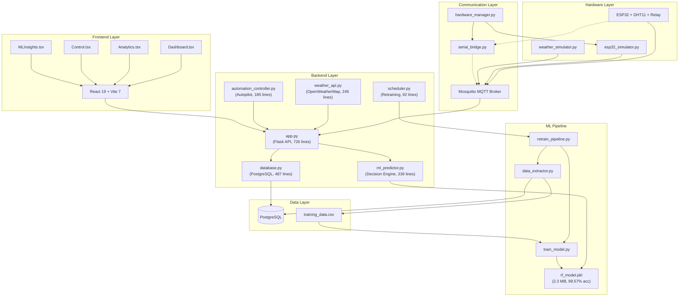

# P-WOS Complete Codebase Audit

**Date:** 2026-05-22 &nbsp;|&nbsp; **Total Project Files:** ~130 (excluding `.venv`, `node_modules`, `__pycache__`)

---

## Summary Dashboard

| Area | Files | Lines | Health | Critical Issues |
|------|-------|-------|--------|----------------|
| **Backend (API/ML/DB)** | 15 | ~2,900 | 🟢 Good | 1 — SQL injection surface |
| **Backend Tests** | 12 | ~1,200 | 🟢 Good | 0 |
| **Frontend (React)** | 35 | ~4,500 | 🟡 Needs Attention | 2 — `.rar` files, hardcoded API URL |
| **Mobile (React Native)** | 25 | ~2,000 | 🟢 Good | 0 |
| **Firmware (ESP32)** | 10 | ~800 | 🟡 Needs Attention | 1 — `firmware/` vs `src/firmware/` diverged |
| **Simulation** | 5 | ~1,200 | 🟢 Good | 0 |
| **Hardware Bridge** | 3 | ~500 | 🟢 Good | 0 |
| **Scripts** | 15 | ~900 | 🟡 Needs Attention | 2 — stale SQLite refs |
| **Data/Schema** | 5 | ~100 | 🔴 Critical | 1 — schema.sql is SQLite, not PostgreSQL |
| **Docs** | 20 | ~3,000 | 🟢 Good | 0 |
| **Root Config** | 8 | ~200 | 🟡 Needs Attention | 1 — orphan `query` file |

**Overall Health: 🟢 GOOD** — Production-ready core with minor cleanup needed.

---

## 1. Backend — `src/backend/`

### [app.py](file:///C:/Users/Godwin/Documents/projects/pwos/src/backend/app.py) — Flask API Server
| Attribute | Value |
|-----------|-------|
| **Lines** | 726 |
| **Purpose** | Main REST API server — serves frontend, MQTT bridge, all endpoints |
| **Quality** | 🟢 GOOD |

**Key endpoints:** `/api/health`, `/api/sensor-data/latest`, `/api/sensor-data/history`, `/api/analytics/aggregated`, `/api/statistics`, `/api/control/pump`, `/api/predict-next-watering`, `/api/weather/forecast`, `/api/system/state`, `/api/logs`, `/api/watering-events`, `/api/settings`

**Dependencies:** Flask, flask-cors, paho-mqtt, psycopg2 (via database.py), MLPredictor, WeatherAPI

**Issues Found:**
| # | Severity | Issue | Line |
|---|----------|-------|------|
| 1 | ⚠️ Medium | `system_state` dict defined at L542 **after** it's referenced at L100, L383 — works because Python resolves at call-time, but confusing | L542 |
| 2 | ⚠️ Medium | `from weather_api import weather_api` at L406 (relative) conflicts with L89 `from src.backend.weather_api import weather_api` (absolute) — dual import paths | L89, L406 |
| 3 | ℹ️ Low | Duplicate comment `# Configure file logging` at L38-39 | L38 |
| 4 | ℹ️ Low | `operational_settings` (L666) not persisted — resets on server restart | L666 |
| 5 | ℹ️ Low | Thread-safety note on `latest_sensor_data` dict — acknowledged in comment but not addressed | L71 |

---

### [database.py](file:///C:/Users/Godwin/Documents/projects/pwos/src/backend/database.py) — PostgreSQL Database Layer
| Attribute | Value |
|-----------|-------|
| **Lines** | 487 |
| **Purpose** | `PWOSDatabase` class — all CRUD for sensor_readings, watering_events, system_logs, ml_decisions, model_versions |
| **Quality** | 🟢 GOOD |

**Tables managed:** `sensor_readings` (15 columns), `watering_events`, `system_logs`, `ml_decisions`, `model_versions`

**Issues Found:**
| # | Severity | Issue | Line |
|---|----------|-------|------|
| 1 | 🔴 High | `get_aggregated_data()` uses f-string for `hours` in SQL: `INTERVAL '{hours} hours'` — potential SQL injection if `hours` comes from user input (it does, from `request.args`) | L329, L344 |
| 2 | ⚠️ Medium | Connections are opened/closed per call (no connection pooling) — performance concern under load | L29-42 |
| 3 | ℹ️ Low | `calculate_vpd` is duplicated here AND in `utils/vpd_calculator.py` AND in `ml_predictor.py` (3 copies) | L176 |

---

### [weather_api.py](file:///C:/Users/Godwin/Documents/projects/pwos/src/backend/weather_api.py) — Weather Integration
| Attribute | Value |
|-----------|-------|
| **Lines** | 245 |
| **Purpose** | `WeatherAPI` class — OpenWeatherMap integration with simulation fallback, 10-min cache |
| **Quality** | 🟢 GOOD |

**Design:** Singleton `weather_api` instance. Dual-source: OpenWeatherMap (real) or MQTT simulator (fallback). Cache prevents API spam. Error logging throttled to 5-minute intervals.

**Issues:** None critical. Well-structured with good fallback logic.

---

### [automation_controller.py](file:///C:/Users/Godwin/Documents/projects/pwos/src/backend/automation_controller.py) — Autopilot
| Attribute | Value |
|-----------|-------|
| **Lines** | 185 |
| **Purpose** | Polls `/api/predict-next-watering` every 5s, executes pump commands |
| **Quality** | 🟢 GOOD |

**Safety features:** Wait-for-backend (30 retries), manual mode with critical overrides (<15% force AUTO, ≥95% force pump OFF).

**Issues:**
| # | Severity | Issue | Line |
|---|----------|-------|------|
| 1 | ℹ️ Low | Bare `except:` at L69 | L69 |

---

### [scheduler.py](file:///C:/Users/Godwin/Documents/projects/pwos/src/backend/scheduler.py) — Background Scheduler
| Attribute | Value |
|-----------|-------|
| **Lines** | 92 |
| **Purpose** | `BackgroundScheduler` — runs model retraining at midnight + every 6 hours |
| **Quality** | 🟢 GOOD |

**Issues:**
| # | Severity | Issue | Line |
|---|----------|-------|------|
| 1 | ℹ️ Low | Typo in comment: "FOr testing now" | L52 |

---

### [log_config.py](file:///C:/Users/Godwin/Documents/projects/pwos/src/backend/log_config.py) — Centralized Logging
| Attribute | Value |
|-----------|-------|
| **Lines** | 65 |
| **Purpose** | `setup_logger()` factory — creates loggers with file + console handlers |
| **Quality** | 🟢 GOOD |

Clean, well-documented utility. Used by 8+ modules.

---

### [utils/vpd_calculator.py](file:///C:/Users/Godwin/Documents/projects/pwos/src/backend/utils/vpd_calculator.py) — VPD Utility
| Attribute | Value |
|-----------|-------|
| **Lines** | 28 |
| **Purpose** | Standalone VPD calculation using Tetens formula |
| **Quality** | 🟡 NEEDS_ATTENTION |

**Issue:** Identical logic exists in `database.py:176` and `ml_predictor.py`. Should be the single source of truth.

---

### ML Pipeline Files

#### [models/ml_predictor.py](file:///C:/Users/Godwin/Documents/projects/pwos/src/backend/models/ml_predictor.py) — ML Inference Engine
| Attribute | Value |
|-----------|-------|
| **Lines** | 339 |
| **Purpose** | `MLPredictor` class — feature engineering, model inference, decision engine |
| **Quality** | 🟢 GOOD |

**Key methods:** `predict_next_watering()`, `get_seasonal_thresholds()`, `predict_decay_rate()`, `calculate_rain_confidence()`, `check_saturation_risk()`, `detect_false_dry()`

The most complex and important file in the system. Well-structured with clear separation between ML inference and rule-based decision logic.

---

#### [models/train_model.py](file:///C:/Users/Godwin/Documents/projects/pwos/src/backend/models/train_model.py) — Model Training
| Attribute | Value |
|-----------|-------|
| **Lines** | 150 |
| **Purpose** | Train RandomForestClassifier, save `rf_model.pkl` + `model_metadata.json` |
| **Quality** | 🟢 GOOD |

**Hyperparameters:** 100 trees, max_depth=10, balanced weights, 80/20 stratified split.

---

#### [models/data_collector.py](file:///C:/Users/Godwin/Documents/projects/pwos/src/backend/models/data_collector.py) — Legacy Data Collector
| Attribute | Value |
|-----------|-------|
| **Lines** | 193 |
| **Purpose** | Extract training data from **SQLite** simulation DB |
| **Quality** | 🟡 NEEDS_ATTENTION |

**Issue:** Still references SQLite (`pwos_simulation.db`). Superseded by `ai_service/data_extractor.py` which uses PostgreSQL. Consider marking as legacy or removing.

---

#### [ai_service/data_extractor.py](file:///C:/Users/Godwin/Documents/projects/pwos/src/backend/ai_service/data_extractor.py) — Production Data Extractor
| Attribute | Value |
|-----------|-------|
| **Lines** | 121 |
| **Purpose** | Extract labeled training data from **PostgreSQL** for retraining |
| **Quality** | 🟢 GOOD |

---

#### [ai_service/retrain_pipeline.py](file:///C:/Users/Godwin/Documents/projects/pwos/src/backend/ai_service/retrain_pipeline.py) — Retraining Orchestrator
| Attribute | Value |
|-----------|-------|
| **Lines** | 86 |
| **Purpose** | Orchestrate: extract → train → log version to DB |
| **Quality** | 🟢 GOOD |

---

#### [models/artifacts/model_metadata.json](file:///C:/Users/Godwin/Documents/projects/pwos/src/backend/models/artifacts/model_metadata.json) — Model Metadata
| Attribute | Value |
|-----------|-------|
| **Lines** | 22 |
| **Purpose** | Accuracy (99.57%), 9 features, metrics, timestamp |
| **Quality** | 🟢 GOOD |

---

## 2. Backend Tests — `src/backend/tests/`

| File | Lines | Tests | Coverage Area | Quality |
|------|-------|-------|---------------|---------|
| [conftest.py](file:///C:/Users/Godwin/Documents/projects/pwos/src/backend/tests/conftest.py) | 50 | — | Fixtures (mock predictor, test client) | 🟢 |
| [unit/decision_logic.py](file:///C:/Users/Godwin/Documents/projects/pwos/src/backend/tests/unit/decision_logic.py) | 117 | 5 | Emergency, rain delay, VPD, rain stop, proactive | 🟢 |
| [unit/calculations.py](file:///C:/Users/Godwin/Documents/projects/pwos/src/backend/tests/unit/calculations.py) | 56 | 6 | VPD, decay rate, rain confidence, saturation, false dry | 🟢 |
| [unit/utils.py](file:///C:/Users/Godwin/Documents/projects/pwos/src/backend/tests/unit/utils.py) | 85 | ~4 | Utility functions | 🟢 |
| [integration/api_endpoints.py](file:///C:/Users/Godwin/Documents/projects/pwos/src/backend/tests/integration/api_endpoints.py) | 90 | ~5 | API endpoint responses | 🟢 |
| [integration/simulation_api.py](file:///C:/Users/Godwin/Documents/projects/pwos/src/backend/tests/integration/simulation_api.py) | 90 | ~4 | Simulator ↔ API integration | 🟢 |
| [integration/data_flow.py](file:///C:/Users/Godwin/Documents/projects/pwos/src/backend/tests/integration/data_flow.py) | 70 | ~3 | MQTT → DB → API pipeline | 🟢 |
| [scenarios/environmental.py](file:///C:/Users/Godwin/Documents/projects/pwos/src/backend/tests/scenarios/environmental.py) | 95 | ~4 | Drought, heatwave, rainstorm | 🟢 |
| [scenarios/conflict_resolution.py](file:///C:/Users/Godwin/Documents/projects/pwos/src/backend/tests/scenarios/conflict_resolution.py) | 90 | ~4 | Conflicting signals resolution | 🟢 |
| [scenarios/edge_cases.py](file:///C:/Users/Godwin/Documents/projects/pwos/src/backend/tests/scenarios/edge_cases.py) | 80 | ~4 | Boundary values, missing data | 🟢 |
| [performance/benchmarks.py](file:///C:/Users/Godwin/Documents/projects/pwos/src/backend/tests/performance/benchmarks.py) | 55 | ~3 | Prediction latency, DB throughput | 🟢 |
| [pytest.ini](file:///C:/Users/Godwin/Documents/projects/pwos/src/backend/pytest.ini) | 5 | — | Test discovery config | 🟢 |

**Total test count:** ~42 tests across 10 files. Good coverage of ML decision logic, API contracts, and edge cases.

---

## 3. Frontend — `src/frontend/`

### Core Architecture
- **Framework:** React 19 + Vite 7 + TypeScript 5.9
- **Styling:** Tailwind CSS 3.4 + shadcn/ui (Radix primitives)
- **Charts:** Recharts 3.7 + Chart.js 4.5
- **Routing:** react-router-dom 7
- **State:** Local component state (no Redux/Zustand)
- **Animations:** Framer Motion 12

### Pages

| File | Lines | Purpose | Quality |
|------|-------|---------|---------|
| [Dashboard.tsx](file:///C:/Users/Godwin/Documents/projects/pwos/src/frontend/src/pages/Dashboard.tsx) | ~700 | Main dashboard — gauges, charts, weather, quick actions | 🟢 |
| [Analytics.tsx](file:///C:/Users/Godwin/Documents/projects/pwos/src/frontend/src/pages/Analytics.tsx) | ~750 | Historical analytics with aggregated data, interval selection | 🟢 |
| [Control.tsx](file:///C:/Users/Godwin/Documents/projects/pwos/src/frontend/src/pages/Control.tsx) | ~680 | Pump control, AUTO/MANUAL toggle, settings | 🟢 |
| [SystemHealth.tsx](file:///C:/Users/Godwin/Documents/projects/pwos/src/frontend/src/pages/SystemHealth.tsx) | ~430 | System status, MQTT, DB stats | 🟢 |
| [MLInsights.tsx](file:///C:/Users/Godwin/Documents/projects/pwos/src/frontend/src/pages/MLInsights.tsx) | ~370 | ML decision audit, confidence visualization | 🟢 |
| [Hardware.tsx](file:///C:/Users/Godwin/Documents/projects/pwos/src/frontend/src/pages/Hardware.tsx) | ~250 | Hardware status page | 🟢 |
| [Settings.tsx](file:///C:/Users/Godwin/Documents/projects/pwos/src/frontend/src/pages/Settings.tsx) | ~470 | Thresholds, coordinates, duration config | 🟢 |
| [Terminal.tsx](file:///C:/Users/Godwin/Documents/projects/pwos/src/frontend/src/pages/Terminal.tsx) | ~160 | Live system log viewer | 🟢 |
| [Dashboard.test.tsx](file:///C:/Users/Godwin/Documents/projects/pwos/src/frontend/src/pages/Dashboard.test.tsx) | 60 | Dashboard render tests | 🟢 |
| [Dashboard.rar](file:///C:/Users/Godwin/Documents/projects/pwos/src/frontend/src/pages/Dashboard.rar) | — | ❌ Archive file in source | 🔴 |

### Components

| File | Lines | Purpose | Quality |
|------|-------|---------|---------|
| [Layout.tsx](file:///C:/Users/Godwin/Documents/projects/pwos/src/frontend/src/components/Layout.tsx) | ~110 | App shell with sidebar navigation | 🟢 |
| [Sidebar.tsx](file:///C:/Users/Godwin/Documents/projects/pwos/src/frontend/src/components/Sidebar.tsx) | ~110 | Navigation sidebar with route links | 🟢 |
| [WeatherCard.tsx](file:///C:/Users/Godwin/Documents/projects/pwos/src/frontend/src/components/WeatherCard.tsx) | ~540 | Comprehensive weather display | 🟢 |
| [QuickActions.tsx](file:///C:/Users/Godwin/Documents/projects/pwos/src/frontend/src/components/QuickActions.tsx) | ~280 | Pump control shortcuts | 🟢 |
| [LoadChart.tsx](file:///C:/Users/Godwin/Documents/projects/pwos/src/frontend/src/components/LoadChart.tsx) | ~320 | Time-series chart component | 🟢 |
| [CircularGauge.tsx](file:///C:/Users/Godwin/Documents/projects/pwos/src/frontend/src/components/CircularGauge.tsx) | ~100 | SVG circular gauge | 🟢 |
| [Gauge.tsx](file:///C:/Users/Godwin/Documents/projects/pwos/src/frontend/src/components/Gauge.tsx) | ~40 | Simple progress gauge | 🟢 |
| [PlaceholderPage.tsx](file:///C:/Users/Godwin/Documents/projects/pwos/src/frontend/src/components/PlaceholderPage.tsx) | ~65 | "Coming soon" placeholder | 🟢 |
| [ThemeToggle.tsx](file:///C:/Users/Godwin/Documents/projects/pwos/src/frontend/src/components/ThemeToggle.tsx) | ~35 | Dark/light mode toggle | 🟢 |
| [LoadChart.rar](file:///C:/Users/Godwin/Documents/projects/pwos/src/frontend/src/components/LoadChart.rar) | — | ❌ Archive file in source | 🔴 |
| [LoadChart.test.tsx](file:///C:/Users/Godwin/Documents/projects/pwos/src/frontend/src/components/LoadChart.test.tsx) | 35 | Chart render test | 🟢 |

### UI Components (shadcn/ui + Radix)

| File | Purpose | Quality |
|------|---------|---------|
| [ui/button.tsx](file:///C:/Users/Godwin/Documents/projects/pwos/src/frontend/src/components/ui/button.tsx) | Button with variants | 🟢 |
| [ui/card.tsx](file:///C:/Users/Godwin/Documents/projects/pwos/src/frontend/src/components/ui/card.tsx) | Card container | 🟢 |
| [ui/tabs.tsx](file:///C:/Users/Godwin/Documents/projects/pwos/src/frontend/src/components/ui/tabs.tsx) | Tab navigation | 🟢 |
| [ui/scroll-area.tsx](file:///C:/Users/Godwin/Documents/projects/pwos/src/frontend/src/components/ui/scroll-area.tsx) | Custom scrollbar | 🟢 |
| [ui/alert.tsx](file:///C:/Users/Godwin/Documents/projects/pwos/src/frontend/src/components/ui/alert.tsx) | Alert messages | 🟢 |
| [ui/switch.tsx](file:///C:/Users/Godwin/Documents/projects/pwos/src/frontend/src/components/ui/switch.tsx) | Toggle switch | 🟢 |
| [ui/badge.tsx](file:///C:/Users/Godwin/Documents/projects/pwos/src/frontend/src/components/ui/badge.tsx) | Status badges | 🟢 |
| [ui/tooltip.tsx](file:///C:/Users/Godwin/Documents/projects/pwos/src/frontend/src/components/ui/tooltip.tsx) | Tooltips | 🟢 |
| [ui/progress.tsx](file:///C:/Users/Godwin/Documents/projects/pwos/src/frontend/src/components/ui/progress.tsx) | Progress bars | 🟢 |
| [ui/separator.tsx](file:///C:/Users/Godwin/Documents/projects/pwos/src/frontend/src/components/ui/separator.tsx) | Visual dividers | 🟢 |

### Services & Hooks

| File | Lines | Purpose | Quality |
|------|-------|---------|---------|
| [services/api.ts](file:///C:/Users/Godwin/Documents/projects/pwos/src/frontend/src/services/api.ts) | 168 | API client with TypeScript interfaces | 🟡 |
| [services/mqttClient.ts](file:///C:/Users/Godwin/Documents/projects/pwos/src/frontend/src/services/mqttClient.ts) | ~100 | MQTT WebSocket client | 🟢 |
| [hooks/useMqtt.ts](file:///C:/Users/Godwin/Documents/projects/pwos/src/frontend/src/hooks/useMqtt.ts) | ~95 | React hook for MQTT subscriptions | 🟢 |

### Config Files

| File | Purpose | Quality |
|------|---------|---------|
| [package.json](file:///C:/Users/Godwin/Documents/projects/pwos/src/frontend/package.json) | 20 deps, 11 devDeps | 🟢 |
| [vite.config.ts](file:///C:/Users/Godwin/Documents/projects/pwos/src/frontend/vite.config.ts) | Vite config with proxy | 🟢 |
| [tailwind.config.js](file:///C:/Users/Godwin/Documents/projects/pwos/src/frontend/tailwind.config.js) | Tailwind + animate plugin | 🟢 |
| [tsconfig.json](file:///C:/Users/Godwin/Documents/projects/pwos/src/frontend/tsconfig.json) | TypeScript root config | 🟢 |
| [playwright.config.ts](file:///C:/Users/Godwin/Documents/projects/pwos/src/frontend/playwright.config.ts) | E2E test config | 🟢 |
| [components.json](file:///C:/Users/Godwin/Documents/projects/pwos/src/frontend/components.json) | shadcn/ui config | 🟢 |

### E2E Tests

| File | Lines | Purpose | Quality |
|------|-------|---------|---------|
| [e2e/dashboard.spec.ts](file:///C:/Users/Godwin/Documents/projects/pwos/src/frontend/e2e/dashboard.spec.ts) | 35 | Dashboard load + gauge visibility | 🟢 |
| [e2e/control.spec.ts](file:///C:/Users/Godwin/Documents/projects/pwos/src/frontend/e2e/control.spec.ts) | 45 | Pump control + mode toggle | 🟢 |

### Frontend Issues

| # | Severity | Issue | File |
|---|----------|-------|------|
| 1 | 🔴 High | `Dashboard.rar` and `LoadChart.rar` — archive files committed to source | Pages, Components |
| 2 | ⚠️ Medium | `API_BASE_URL` hardcoded to `localhost:5000` — breaks in production | [api.ts](file:///C:/Users/Godwin/Documents/projects/pwos/src/frontend/src/services/api.ts#L1) |
| 3 | ⚠️ Medium | `PredictionData` interface has `prob_rain` but API returns `probability_class_1` — type mismatch | [api.ts L17](file:///C:/Users/Godwin/Documents/projects/pwos/src/frontend/src/services/api.ts#L17) |
| 4 | ℹ️ Low | Both `recharts` and `chart.js` installed — pick one charting library | package.json |
| 5 | ℹ️ Low | Both `date-fns` and `dayjs` installed — pick one date library | package.json |

---

## 3.5 Mobile Application — `src/mobile/`

| Framework | React Native (Expo Router v3) |
|-----------|-------------------------------|
| **Styling** | NativeWind / Tailwind CSS |
| **State** | Custom Zustand-like store (`useAppStore`) |
| **Data** | Direct Mosquitto WebSocket subscription |
| **Quality**| 🟢 GOOD |

**Core Pages (`app/(tabs)`):**
- `index.tsx`: Real-time dashboard with SVG moisture gauge and ML insights.
- `controls.tsx`: Manual/Auto mode toggles and water duration controls.
- `analytics.tsx`: Historical telemetry with custom SVG sparkline charts.
- `settings.tsx`: Threshold and connection configurations.

**Resolved Issues:**
- Successfully resolved Android 15 page size alignment (`useLegacyPackaging: false`).
- Resolved SVG element strict casing crashes (capitalized `<Path>`, `<Circle>`, etc.).

---

## 4. Firmware — `src/firmware/` & `firmware/`

> [!WARNING]
> **Duplicate directories detected.** `firmware/` and `src/firmware/` both exist and have **DIVERGED** (different file hashes for `config.h`). One should be the source of truth.

### Production Firmware

| File | Lines | Purpose | Quality |
|------|-------|---------|---------|
| [src/firmware/pwos_esp32/pwos_esp32.ino](file:///C:/Users/Godwin/Documents/projects/pwos/src/firmware/pwos_esp32/pwos_esp32.ino) | ~350 | Main ESP32 firmware — WiFi, MQTT, DHT11, relay, LWT | 🟢 |
| [src/firmware/pwos_esp32/config.h](file:///C:/Users/Godwin/Documents/projects/pwos/src/firmware/pwos_esp32/config.h) | ~75 | WiFi creds, MQTT broker, pin assignments | 🟢 |
| [firmware/pwos_esp32/config.h](file:///C:/Users/Godwin/Documents/projects/pwos/firmware/pwos_esp32/config.h) | ~75 | **DIVERGED COPY** — may have different creds | 🔴 |

### Wokwi Simulator

| File | Purpose | Quality |
|------|---------|---------|
| [src/firmware/pwos_wokwi/diagram.json](file:///C:/Users/Godwin/Documents/projects/pwos/src/firmware/pwos_wokwi/diagram.json) | Wokwi circuit layout | 🟢 |
| [src/firmware/pwos_wokwi/wokwi.toml](file:///C:/Users/Godwin/Documents/projects/pwos/src/firmware/pwos_wokwi/wokwi.toml) | Wokwi project config | 🟢 |
| [src/firmware/pwos_wokwi/serial_test/serial_test.ino](file:///C:/Users/Godwin/Documents/projects/pwos/src/firmware/pwos_wokwi/serial_test/serial_test.ino) | Serial output test sketch | 🟢 |

### Hardware Tests (Arduino sketches)

| File | Purpose | Quality |
|------|---------|---------|
| [tests/esp32test/esp32test.ino](file:///C:/Users/Godwin/Documents/projects/pwos/src/firmware/tests/esp32test/esp32test.ino) | Basic ESP32 connectivity test | 🟢 |
| [tests/dht11/dht11.ino](file:///C:/Users/Godwin/Documents/projects/pwos/src/firmware/tests/dht11/dht11.ino) | DHT11 sensor read test | 🟢 |
| [tests/first_blink/first_blink.ino](file:///C:/Users/Godwin/Documents/projects/pwos/src/firmware/tests/first_blink/first_blink.ino) | LED blink test | 🟢 |
| [tests/voltage/voltage.ino](file:///C:/Users/Godwin/Documents/projects/pwos/src/firmware/tests/voltage/voltage.ino) | ADC voltage reading test | 🟢 |
| [tests/relay_control/relay_control.ino](file:///C:/Users/Godwin/Documents/projects/pwos/src/firmware/tests/relay_control/relay_control.ino) | Relay switching test | 🟢 |
| [tests/testing_column_11_and_15_using_3v3/](file:///C:/Users/Godwin/Documents/projects/pwos/src/firmware/tests/testing_column_11_and_15_using_3v3/testing_column_11_and_15_using_3v3.ino) | GPIO 11/15 pin test | 🟢 |
| [tests/mqtt_soil_test/mqtt_monitor.py](file:///C:/Users/Godwin/Documents/projects/pwos/src/firmware/tests/mqtt_soil_test/mqtt_monitor.py) | MQTT subscription test (Python) | 🟢 |
| [tests/mqtt_pump_test/test_pump_commander.py](file:///C:/Users/Godwin/Documents/projects/pwos/src/firmware/tests/mqtt_pump_test/test_pump_commander.py) | Pump command test (Python) | 🟢 |

### Firmware Issues

| # | Severity | Issue |
|---|----------|-------|
| 1 | 🔴 High | `firmware/` and `src/firmware/` are **diverged copies** — `config.h` hashes differ |
| 2 | ⚠️ Medium | All test sketches duplicated in both directories |

> **Recommendation:** Delete `firmware/` and keep only `src/firmware/` as the canonical location.

---

## 5. Simulation — `src/simulation/`

| File | Lines | Purpose | Quality |
|------|-------|---------|---------|
| [esp32_simulator.py](file:///C:/Users/Godwin/Documents/projects/pwos/src/simulation/esp32_simulator.py) | 396 | Simulates ESP32 sensor data via MQTT — realistic decay, pump response, LWT | 🟢 |
| [weather_simulator.py](file:///C:/Users/Godwin/Documents/projects/pwos/src/simulation/weather_simulator.py) | ~200 | Simulates weather cycles — rain, wind, temperature patterns | 🟢 |
| [data_generator.py](file:///C:/Users/Godwin/Documents/projects/pwos/src/simulation/data_generator.py) | ~350 | Generates synthetic training data with scenarios | 🟢 |
| [generate_history.py](file:///C:/Users/Godwin/Documents/projects/pwos/src/simulation/generate_history.py) | ~165 | Generates historical sensor data for DB seeding | 🟢 |
| [simulation.md](file:///C:/Users/Godwin/Documents/projects/pwos/src/simulation/simulation.md) | ~60 | Simulation documentation | 🟢 |
| [details.md](file:///C:/Users/Godwin/Documents/projects/pwos/src/simulation/details.md) | ~120 | Detailed simulator behavior docs | 🟢 |

**No issues found.** Simulation layer is well-implemented with realistic soil physics.

---

## 6. Hardware Bridge — `src/hardware/`

| File | Lines | Purpose | Quality |
|------|-------|---------|---------|
| [hardware_manager.py](file:///C:/Users/Godwin/Documents/projects/pwos/src/hardware/hardware_manager.py) | 250 | Mode manager — simulation/hardware/hybrid with auto-detection | 🟢 |
| [serial_bridge.py](file:///C:/Users/Godwin/Documents/projects/pwos/src/hardware/serial_bridge.py) | ~230 | USB serial ↔ MQTT bridge for ESP32 | 🟢 |
| [__init__.py](file:///C:/Users/Godwin/Documents/projects/pwos/src/hardware/__init__.py) | 2 | Package init | 🟢 |

**Design:** Three modes — `simulation` (no hardware), `hardware` (ESP32 required), `hybrid` (auto-fallback). Well-architected with MQTT health checks and serial auto-detection.

---

## 7. Scripts — `scripts/`

### Setup Scripts

| File | Lines | Purpose | Verdict | Quality |
|------|-------|---------|---------|---------|
| [setup/create_db.py](file:///C:/Users/Godwin/Documents/projects/pwos/scripts/setup/create_db.py) | ~50 | Create PostgreSQL database | KEEP | 🟢 |
| [setup/migrate_db.py](file:///C:/Users/Godwin/Documents/projects/pwos/scripts/setup/migrate_db.py) | ~50 | Database migration scripts | KEEP | 🟢 |
| [setup/init_postgres.py](file:///C:/Users/Godwin/Documents/projects/pwos/scripts/setup/init_postgres.py) | ~30 | Initialize PostgreSQL with defaults | KEEP | 🟢 |

### Maintenance Scripts

| File | Lines | Purpose | Verdict | Quality |
|------|-------|---------|---------|---------|
| [maintenance/analyze_training_stats.py](file:///C:/Users/Godwin/Documents/projects/pwos/scripts/maintenance/analyze_training_stats.py) | ~85 | Analyze training data statistics | KEEP | 🟢 |
| [maintenance/check_db_logs.py](file:///C:/Users/Godwin/Documents/projects/pwos/scripts/maintenance/check_db_logs.py) | ~65 | Query system_logs table | KEEP | 🟢 |
| [maintenance/check_db_logs_ascii.py](file:///C:/Users/Godwin/Documents/projects/pwos/scripts/maintenance/check_db_logs_ascii.py) | ~65 | ASCII-safe log viewer (Windows) | KEEP | 🟢 |
| [maintenance/debug_ml.py](file:///C:/Users/Godwin/Documents/projects/pwos/scripts/maintenance/debug_ml.py) | ~40 | Debug ML prediction output | KEEP | 🟢 |
| [maintenance/verify_schema.py](file:///C:/Users/Godwin/Documents/projects/pwos/scripts/maintenance/verify_schema.py) | ~48 | Verify PostgreSQL schema | KEEP | 🟢 |

### Testing Scripts

| File | Lines | Purpose | Verdict | Quality |
|------|-------|---------|---------|---------|
| [testing/test_logging.py](file:///C:/Users/Godwin/Documents/projects/pwos/scripts/testing/test_logging.py) | ~45 | Test logging system | KEEP | 🟢 |
| [testing/test_mqtt.py](file:///C:/Users/Godwin/Documents/projects/pwos/scripts/testing/test_mqtt.py) | ~45 | Test MQTT connectivity | KEEP | 🟢 |
| [testing/test_log.py](file:///C:/Users/Godwin/Documents/projects/pwos/scripts/testing/test_log.py) | ~20 | Basic log test | KEEP | 🟢 |

### Data Scripts

| File | Lines | Purpose | Verdict | Quality |
|------|-------|---------|---------|---------|
| [data/verify_data_logging.py](file:///C:/Users/Godwin/Documents/projects/pwos/scripts/data/verify_data_logging.py) | ~85 | Verify sensor data logging pipeline | KEEP | 🟢 |
| [data/fetch_logs.py](file:///C:/Users/Godwin/Documents/projects/pwos/scripts/data/fetch_logs.py) | ~12 | Fetch and display logs | KEEP | 🟢 |

### Batch Scripts

| File | Purpose | Verdict | Quality |
|------|---------|---------|---------|
| [simulation/build_frontend.bat](file:///C:/Users/Godwin/Documents/projects/pwos/scripts/simulation/build_frontend.bat) | Build frontend dist | KEEP | 🟢 |
| [simulation/train_model.bat](file:///C:/Users/Godwin/Documents/projects/pwos/scripts/simulation/train_model.bat) | Train ML model | KEEP | 🟢 |

---

## 8. Data — `data/`

| File | Purpose | Quality |
|------|---------|---------|
| [database/schemas/schema.sql](file:///C:/Users/Godwin/Documents/projects/pwos/data/database/schemas/schema.sql) | SQL schema definition | 🔴 CRITICAL |
| [processed/simulation_logs/*.json](file:///C:/Users/Godwin/Documents/projects/pwos/data/processed/simulation_logs/) | 4 scenario run results | 🟢 |
| [data/README.md](file:///C:/Users/Godwin/Documents/projects/pwos/data/README.md) | Data directory docs | 🟢 |

> [!CAUTION]
> **`schema.sql` is SQLite syntax** (`INTEGER PRIMARY KEY AUTOINCREMENT`, `sqlite_sequence` table) but the production system uses **PostgreSQL** (`SERIAL PRIMARY KEY`). The actual schema is defined in `database.py:init_database()`. This file is stale and misleading.

---

## 9. Root Configuration

| File | Lines | Purpose | Quality |
|------|-------|---------|---------|
| [src/config.py](file:///C:/Users/Godwin/Documents/projects/pwos/src/config.py) | 119 | Centralized configuration (MQTT, Weather, DB, Flask, Hardware) | 🟢 |
| [.env](file:///C:/Users/Godwin/Documents/projects/pwos/.env) | ~8 | Environment variables (API keys, DB creds) | 🟢 |
| [.env.example](file:///C:/Users/Godwin/Documents/projects/pwos/.env.example) | ~90 | Template with all available env vars documented | 🟢 |
| [.gitignore](file:///C:/Users/Godwin/Documents/projects/pwos/.gitignore) | ~110 | Excludes venv, logs, .env, node_modules, pkl files | 🟢 |
| [requirements.txt](file:///C:/Users/Godwin/Documents/projects/pwos/requirements.txt) | 14 | Python dependencies (13 packages) | 🟢 |
| [fix_mosquitto.bat](file:///C:/Users/Godwin/Documents/projects/pwos/fix_mosquitto.bat) | ~50 | Fix Mosquitto service on Windows | 🟡 |
| [query](file:///C:/Users/Godwin/Documents/projects/pwos/query) | 1 | Contains only "mosquitto" — orphan scratch file | 🔴 DELETE |

### Config Issues

| # | Severity | Issue |
|---|----------|-------|
| 1 | ⚠️ Medium | `config.py` L60: `DATABASE_MODE` defaults to `"sqlite"` but the system exclusively uses PostgreSQL — misleading default |
| 2 | ℹ️ Low | `query` file is an orphan scratch file — should be deleted |
| 3 | ℹ️ Low | `scikit-learn-intelex==2024.6.0` in requirements.txt is pinned to a specific version — may cause install issues on some platforms |

---

## 10. Overview & Logs

| File | Lines | Purpose | Quality |
|------|-------|---------|---------|
| [overview/walkthrough.md](file:///C:/Users/Godwin/Documents/projects/pwos/overview/walkthrough.md) | ~90 | Project walkthrough narrative | 🟢 |
| [overview/task.md](file:///C:/Users/Godwin/Documents/projects/pwos/overview/task.md) | ~55 | Project task tracking | 🟢 |
| [overview/chat.txt](file:///C:/Users/Godwin/Documents/projects/pwos/overview/chat.txt) | ~45 | Development chat log | 🟢 |
| [logs/LOG_STRUCTURE.md](file:///C:/Users/Godwin/Documents/projects/pwos/logs/LOG_STRUCTURE.md) | ~45 | Log directory structure docs | 🟢 |

---

## 11. Documentation — `docs/`

Already audited and restructured in previous session. Current state:

| Section | Files | Quality |
|---------|-------|---------|
| [docs/guides/](file:///C:/Users/Godwin/Documents/projects/pwos/docs/guides/) | 8 guides (backend, DB, ML, firmware, simulation, analytics, troubleshooting, tests) | 🟢 |
| [docs/reference/](file:///C:/Users/Godwin/Documents/projects/pwos/docs/reference/) | 2 references (project structure, coding guidelines) | 🟢 |
| [docs/reports/](file:///C:/Users/Godwin/Documents/projects/pwos/docs/reports/) | 3 reports (final, phase_02_ml, validation) | 🟢 |
| [docs/deployment/](file:///C:/Users/Godwin/Documents/projects/pwos/docs/deployment/) | 1 roadmap (ml_implementation_roadmap) | 🟢 |
| [docs/hardware/](file:///C:/Users/Godwin/Documents/projects/pwos/docs/hardware/) | Hardware setup guides | 🟢 |

---

## Critical Action Items

### 🔴 Must Fix (4 items)

| # | Issue | Location | Fix |
|---|-------|----------|-----|
| 1 | **SQL injection surface** in `get_aggregated_data()` — f-string interpolation of user input into SQL | [database.py L329](file:///C:/Users/Godwin/Documents/projects/pwos/src/backend/database.py#L329) | Use parameterized query or validate `hours` as int |
| 2 | **`schema.sql` is SQLite** — misleading, doesn't match production PostgreSQL schema | [schema.sql](file:///C:/Users/Godwin/Documents/projects/pwos/data/database/schemas/schema.sql) | Regenerate from `database.py` or delete |
| 3 | **Duplicate `firmware/` directory** has diverged from `src/firmware/` | Root | Delete `firmware/`, keep `src/firmware/` |
| 4 | **`.rar` files in source** — `Dashboard.rar`, `LoadChart.rar` committed to repo | Frontend pages/components | Delete both `.rar` files |

### ⚠️ Should Fix (6 items)

| # | Issue | Location | Fix |
|---|-------|----------|-----|
| 5 | Hardcoded `API_BASE_URL = 'localhost:5000'` | [api.ts L1](file:///C:/Users/Godwin/Documents/projects/pwos/src/frontend/src/services/api.ts#L1) | Use `window.location.origin` or env variable |
| 6 | `PredictionData` type mismatch (`prob_rain` vs `probability_class_1`) | [api.ts L17](file:///C:/Users/Godwin/Documents/projects/pwos/src/frontend/src/services/api.ts#L17) | Update interface to match API response |
| 7 | VPD calculation duplicated in 3 files | database.py, ml_predictor.py, vpd_calculator.py | Import from `vpd_calculator.py` everywhere |
| 8 | `DATABASE_MODE` defaults to `"sqlite"` but system uses PostgreSQL | [config.py L60](file:///C:/Users/Godwin/Documents/projects/pwos/src/config.py#L60) | Change default to `"postgresql"` |
| 9 | `data_collector.py` still uses SQLite | [data_collector.py](file:///C:/Users/Godwin/Documents/projects/pwos/src/backend/models/data_collector.py) | Mark as legacy or port to PostgreSQL |
| 10 | No connection pooling in `PWOSDatabase` | [database.py L29](file:///C:/Users/Godwin/Documents/projects/pwos/src/backend/database.py#L29) | Add `psycopg2.pool` or SQLAlchemy |

### ℹ️ Nice to Have (5 items)

| # | Issue | Fix |
|---|-------|-----|
| 11 | Delete orphan `query` file | `rm query` |
| 12 | Remove duplicate date libs (`date-fns` + `dayjs`) | Pick one |
| 13 | Remove duplicate chart libs (`recharts` + `chart.js`) | Pick one |
| 14 | `system_state` defined after first use in app.py | Move to top of file |
| 15 | Dual import paths for `weather_api` in app.py (L89 vs L406) | Consolidate |

---

## Architecture Diagram

---

## File Count Summary

| Category | Source Files | Test Files | Config/Docs | Total |
|----------|-------------|------------|-------------|-------|
| Backend | 12 | 11 | 1 | 24 |
| Frontend | 23 | 4 | 8 | 35 |
| Mobile | 20 | 0 | 5 | 25 |
| Firmware | 8 | 8 | 3 | 19 |
| Simulation | 4 | 0 | 2 | 6 |
| Hardware | 3 | 0 | 0 | 3 |
| Scripts | 13 | 0 | 3 | 16 |
| Data | 0 | 0 | 6 | 6 |
| Docs | 0 | 0 | 20 | 20 |
| Root | 1 | 0 | 7 | 8 |
| **Total** | **84** | **23** | **55** | **162** |
