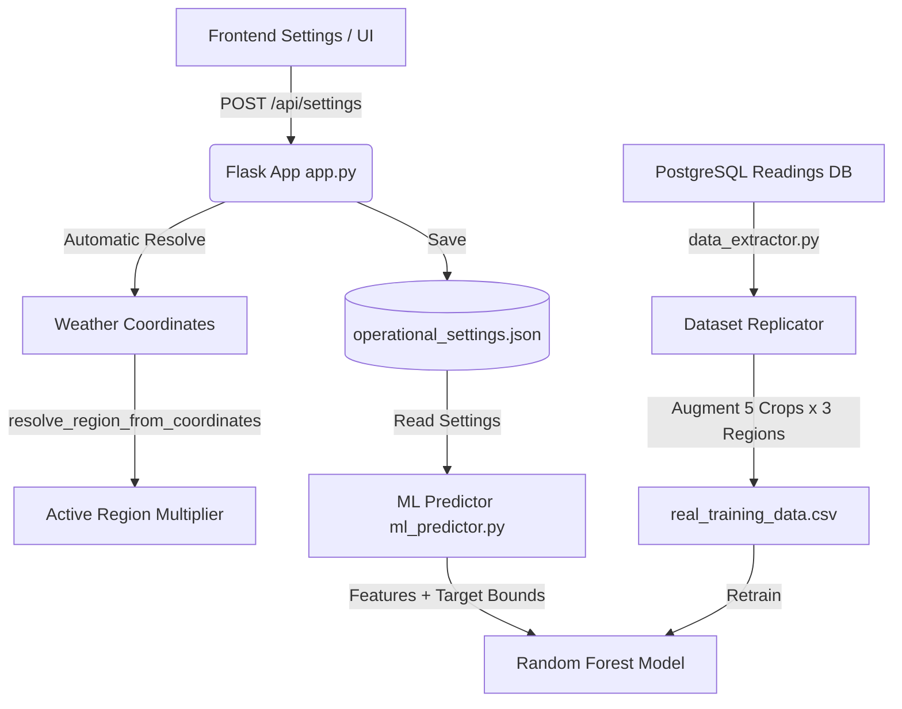

# P-WOS Crop & Region Integration Plan

> ✅ **STATUS: FULLY IMPLEMENTED** — All items in this plan have been built and are live in `main` as of May 2026.

This document details the architectural plan to integrate multiple crops and regional weather configurations into the production Predictive Water Optimization System (P-WOS).

---

## 📋 Architectural Overview

To transform P-WOS into a highly adaptive agricultural system, we are implementing a **Unified Crop & Region-Aware Machine Learning Model** combined with **Automatic Coordinate Weather Resolving** and an **Interactive Context Dashboard**.



---

## 1. Crop Agronomic Profiles & Parameters

The system embeds the following agronomic targets for five key Zimbabwean crops:

| Crop | Target Moisture | Critical Moisture | Low Threshold | Proactive Threshold | High/Saturation Limit | Evaporation Multiplier |
| :--- | :---: | :---: | :---: | :---: | :---: | :---: |
| **Maize** | 60% | 30% | 45% | 55% | 75% | 1.0x (Standard) |
| **Potatoes** | 70% | 45% | 55% | 65% | 85% | 1.4x (Water-Intensive) |
| **Tomatoes** | 62% | 35% | 48% | 58% | 75% | 1.2x (Sensitive) |
| **Onions** | 65% | 40% | 52% | 60% | 80% | 0.8x (Shallow roots) |
| **Sorghum** | 50% | 20% | 30% | 40% | 65% | 0.6x (Drought-Tolerant) |

---

## 2. Dataset Sourcing & Retraining Strategy ✅

### "Where do we get training datasets for these?"
Instead of requiring years of manual sensor installations for 5 distinct crops across 3 regions, we use a **Mathematical Dataset Augmentation** strategy:
1. **Base Telemetry**: We leverage our existing high-fidelity `real_training_data.csv` (comprising over ~45,000 real physical readings of soil moisture decay, temperature, humidity, wind, and VPD).
2. **Real Regional Weather Data**: Ingested 15-day hourly CSV files from the **Visual Crossing API** for Bulawayo, Harare, and Mutare, stored in `data/`.
3. **Replication & Feature Injection**: `data_extractor.py` replicates each telemetry row for each of the 5 crops and 3 regions, injecting:
   - `crop_target_moisture`
   - `crop_critical_moisture`
   - `region_evap_multiplier`
4. **Dynamic Re-labeling**: `needs_watering_soon` is recomputed based on each crop's thresholds. A 35% moisture reading labels Sorghum as comfortable but Potatoes as critically dry.
5. **Result**: **630,000 training samples** (5 crops × 3 regions × ~42,000 base readings).
   - Training split: 504,000 / Testing: 126,000
   - Merged with **Mendeley Tomato IoT dataset** and **Zenodo Maize Arid farming dataset**.

---

## 3. Weather API & Automatic Region Resolving ✅

### "This should follow our weather API, if weather API is set to Bulawayo then that is that"
The regional evaporative multipliers **automatically adapt to the coordinates and city settings** configured in the Weather API/Settings.

We will implement a coordinate-based geographical resolver function:
```python
def resolve_region_from_coordinates(lat, lon):
    """
    Map coordinates to one of three standard Zimbabwean agro-ecological regions:
    1. Matabeleland / Bulawayo (Semi-arid, High Evaporation)
    2. Mashonaland / Harare (Sub-humid, Moderate Evaporation)
    3. Manicaland / Eastern Highlands (Humid, Cool, Low Evaporation)
    """
    # Matabeleland (Bulawayo) bounding check (generally Southern/Western Zimbabwe)
    if -22.5 <= lat <= -19.0 and 25.0 <= lon <= 30.0:
        return 'matabeleland', 1.5
    # Manicaland (Eastern Highlands) bounding check (Eastern border)
    elif -21.0 <= lat <= -17.5 and 32.0 <= lon <= 34.0:
        return 'manicaland', 0.6
    # Default to Mashonaland (Harare/Central Plateau)
    else:
        return 'mashonaland', 1.0
```

This guarantees that when the system's `latitude` and `longitude` are updated (e.g. to Bulawayo `-20.15, 28.58`), the backend automatically adjusts the evaporative multiplier to **1.5x** and updates the crop models on the fly!

---

## 4. Frontend High-Visibility Context Dashboard ✅

### "We need like a front page where they choose or see the currently selected and allows to change @ml insights"
The **Active Crop Context Manager** is integrated at the top of:
1. **The Main Dashboard (`Dashboard.tsx`)** — quick crop selector dropdown with threshold visualization gauge
2. **The ML Insights screen (`MLInsights.tsx`)** — crop context badge
3. **Dedicated Crop Settings Page (`CropSettings.tsx`)** — full management page:
   - Beautiful crop cards: Maize, Potatoes, Tomatoes, Onions, Sorghum with root depth / transpiration info
   - Interactive coordinate geofencing card with instant region resolution
   - Dynamic gauge bar chart showing calibration boundaries and seasonal adjustments
   - Success toasts via `sonner` on crop/coordinate change

---

## 5. Automation Controller Failsafe Integration ✅

Crop safety in autopilot mode uses dynamic thresholds from `/api/settings`:
- **Old hardcoded failsafe**: Force override if moisture < 15%.
- **New dynamic failsafe**: Force override if moisture goes below `crop_critical_moisture` (e.g. 45% for Potatoes, 20% for Sorghum) or above `crop_high_threshold`.
- **Bug fix applied**: Endpoint call corrected from `/sensors/latest` to `/sensor-data/latest`.
