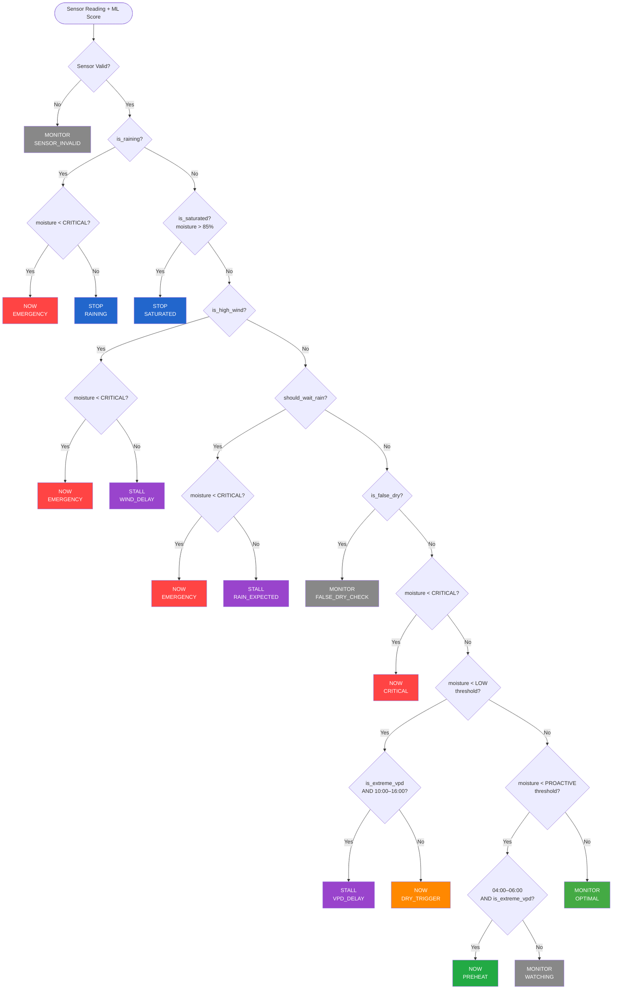

# ML Model Deep Dive

> **P-WOS Technical Reference** | System Behaviour Layer  
> Document type: Definitive technical reference for the machine learning subsystem  
> Scope: Model architecture, feature engineering, decision logic, training pipeline, and operational guidance

---

## Table of Contents

1. [What the Model Is Predicting](#1-what-the-model-is-predicting)
2. [The 12 Input Features](#2-the-12-input-features)
3. [Rolling Features & Trend Detection](#3-rolling-features--trend-detection)
4. [The Labeling Strategy](#4-the-labeling-strategy)
5. [Class Imbalance](#5-class-imbalance)
6. [Reading the Confidence Score](#6-reading-the-confidence-score)
7. [Sensor Validity Guard](#7-sensor-validity-guard)
8. [Why Random Forest, Not Neural Network](#8-why-random-forest-not-neural-network)
9. [The Two-Layer Architecture](#9-the-two-layer-architecture)
10. [Full Decision Engine State Machine](#10-full-decision-engine-state-machine)
11. [In-Memory Settings Injection](#11-in-memory-settings-injection)
12. [Self-Retraining](#12-self-retraining)
13. [Model Drift Indicators](#13-model-drift-indicators)

---

## 1. What the Model Is Predicting

The P-WOS ML model solves a **binary classification** problem. Its sole output is a single integer:

| Value | Label | Meaning |
|-------|-------|---------|
| `1`   | `needs_watering_soon = True`  | Conditions indicate the crop will require irrigation within the next ~2 hours |
| `0`   | `needs_watering_soon = False` | Current soil and environmental conditions do not indicate imminent water stress |

### Why "soon" and not "now"?

The target variable is intentionally predictive, not reactive. A reading of `1` means the system has detected the **early-warning signature** that precedes a watering event — not that the soil is already critically dry. This gives the Decision Engine time to schedule irrigation proactively, ahead of VPD peaks, before midday heat, or before forecast rain makes it unnecessary.

A reading of `0` does not mean "never water." It means the current sensor + environmental snapshot does not meet the learned pattern for an imminent need.

---

## 2. The 12 Input Features

The model accepts exactly **12 base features** in the order listed below. Order matters — the feature vector is positional.

| # | Feature Name | Type | Range / Units | Source | Role in Decision |
|---|---|---|---|---|---|
| 1 | `soil_moisture` | `float` | 0–100 % | Soil sensor (live reading) | Primary drought signal |
| 2 | `temperature` | `float` | °C | Weather station | Evapotranspiration proxy |
| 3 | `humidity` | `float` | 0–100 % | Weather station | VPD component |
| 4 | `wind_speed` | `float` | km/h | Weather station | Evaporation accelerator |
| 5 | `rain_intensity` | `float` | 0–100 | Weather station | Suppresses watering need |
| 6 | `vpd` | `float` | kPa | Calculated (Tetens formula) | Atmospheric water demand |
| 7 | `is_extreme_vpd` | `binary` | 0 or 1 | Derived: 1 if VPD > 2.0 kPa | Midday stress flag |
| 8 | `is_raining` | `binary` | 0 or 1 | Derived: 1 if rain_intensity > 0 | Natural watering event flag |
| 9 | `is_high_wind` | `binary` | 0 or 1 | Derived: 1 if wind_speed > 20 km/h | Spray drift / loss flag |
| 10 | `crop_target_moisture` | `float` | % (crop-specific) | Active crop settings | Desired soil moisture ceiling |
| 11 | `crop_critical_moisture` | `float` | % (crop-specific) | Active crop settings | Emergency-trigger floor |
| 12 | `region_evap_multiplier` | `float` | dimensionless | Region config | Regional evaporation scaling |

### Region Evaporation Multipliers

The `region_evap_multiplier` encodes Zimbabwe's distinct agro-climatic zones directly into the feature vector:

| Region | Multiplier | Rationale |
|---|---|---|
| Matabeleland | `1.5` | Semi-arid lowveld; highest evaporation pressure |
| Mashonaland | `1.0` | Baseline; central highveld benchmark |
| Manicaland | `0.6` | Eastern highlands; high rainfall, lower ET |

### VPD Calculation — Tetens Formula

Vapour Pressure Deficit is computed from temperature (T, °C) and relative humidity (RH, %):

```
e_sat = 0.6108 × exp(17.27 × T / (T + 237.3))   [kPa]
e_act = e_sat × (RH / 100)
VPD   = e_sat − e_act                             [kPa]
```

VPD represents the atmosphere's "thirst" — how hard it is pulling moisture from leaves and soil. A VPD above 2.0 kPa triggers `is_extreme_vpd = 1`, which the Decision Engine uses to stall midday irrigation (water would mostly evaporate before reaching roots).

---

## 3. Rolling Features & Trend Detection

Beyond the 12 base features, **8 derived temporal features** are appended to the feature vector at inference time. These are defined in `model_metadata.json` under `training_features` and computed from the sensor reading history buffer.

| Feature | Calculation | Window | Purpose |
|---|---|---|---|
| `moisture_change_rate` | `(latest_moisture − previous_moisture) / Δt` | Last 2 readings | Detects rapid drainage; a fast-falling moisture curve is a stronger predictor than absolute moisture level |
| `moisture_rolling_6` | `mean(last 6 soil_moisture readings)` | ~30 min (at 5-sec cycles, sampled per reading) | Smooths sensor noise; reveals genuine drying trend vs. transient spike |
| `temp_rolling_6` | `mean(last 6 temperature readings)` | ~30 min | Tracks heat build-up; sustained high temp elevates water demand |
| `forecast_minutes` | Minutes until next forecast rain event | Live forecast API | Suppresses unnecessary irrigation when rain is imminent |
| `hour` | `datetime.now().hour` (0–23) | Point in time | Encodes daily cycle; model learned that morning (5–7 am) needs are different from afternoon needs |
| `day_of_week` | `datetime.now().weekday()` (0–6) | Point in time | Encodes weekly agricultural patterns |
| `is_daytime` | `1` if `6 ≤ hour ≤ 18` | Point in time | Broad day/night flag for evapotranspiration context |
| `is_hot_hours` | `1` if `10 ≤ hour ≤ 16` | Point in time | Peak VPD window; high-confidence stall trigger |

### Why Trend Matters More Than Absolute Level

Consider two readings, both showing `soil_moisture = 42%` against a crop target of `60%`:

- **Scenario A:** `moisture_change_rate = −0.1 %/hour` → soil is barely moving; no immediate concern.
- **Scenario B:** `moisture_change_rate = −4.8 %/hour` → soil is draining fast (recently heavy activity, sandy soil, high wind). At this rate, critical threshold will be breached in under 2 hours.

The absolute value is identical. Only the trend feature distinguishes them. This is why `moisture_change_rate` typically ranks among the top-5 feature importances in the trained Random Forest.

---

## 4. The Labeling Strategy

### Dataset Scale

| Split | Samples | Percentage |
|---|---|---|
| Training set | 504,000 | 80% |
| Test set | 126,000 | 20% |
| **Total** | **630,000** | 100% |

630,000 labeled records were produced by `data_extractor.py` querying the PostgreSQL historical readings table and matching sensor readings to logged watering events.

### Production Labeling — 2-Hour Lookback (Current)

```
For each watering event at time T:
  Label all sensor readings in the window [T − 2h, T) as needs_watering_soon = 1
  All other readings → 0
```

**Why this window?** A 2-hour lookback captures the environmental signature that *immediately precedes* a watering decision. Soil moisture, VPD, temperature, and change rate at T−2h are genuinely predictive of the event at T. This creates tight, high-quality positive labels that the model can learn to recognise with high precision.

### Legacy Labeling — 24-Hour Lookahead

```
For each sensor reading at time T:
  If a watering event occurred at any time in [T, T + 24h] → label = 1
  Else → 0
```

**Why it was replaced:** A 24-hour forward window creates extremely noisy positive labels. A reading at 3 am labelled `1` because irrigation ran at 11 pm the following night tells the model almost nothing useful about what 3 am sensor conditions look like. This inflated recall artificially while degrading precision. The 2-hour lookback is strictly superior for operational use.

---

## 5. Class Imbalance

In any continuous agricultural monitoring system, the overwhelming majority of sensor readings occur while the soil is adequately moist and no irrigation is needed. A typical P-WOS deployment might trigger watering 2–4 times per day, each lasting 20–45 minutes, against a background of thousands of 5-second sensor cycles. This means:

- **Class 0 (no watering needed):** ~85–92% of all readings
- **Class 1 (needs watering soon):** ~8–15% of all readings

### The Problem Without Correction

A naïve classifier that always predicts `0` achieves ~88% accuracy while being completely useless. It would never trigger irrigation.

### The Fix: `class_weight='balanced'`

The `RandomForestClassifier` is initialised with `class_weight='balanced'`. Scikit-learn computes per-class weights as:

```
weight_c = n_samples / (n_classes × n_samples_c)
```

This makes each misclassification of the minority class (watering needed) count proportionally more in the loss function during training. The model is effectively penalised more heavily for missing an irrigation event than for a false alarm.

**Result:** The model learns to be appropriately sensitive to the minority class rather than defaulting to the majority. This is what enables the 72% recall on Class 1 despite the imbalance.

---

## 6. Reading the Confidence Score

### The Published Metrics

| Metric | Value | What It Measures |
|---|---|---|
| Overall Accuracy | **83.43%** | Fraction of all predictions (both classes) that are correct |
| Precision (Class 1) | **96%** | Of all predictions of "watering needed", 96% were genuinely needed |
| Recall (Class 1) | **72%** | Of all genuine watering-needed events, the model detected 72% |
| F1 Score (Class 1) | **82%** | Harmonic mean of precision and recall |

### False Positives vs. False Negatives — Which Is Worse?

| Error Type | Definition | P-WOS Consequence |
|---|---|---|
| **False Positive** | Model says "water needed", but it wasn't | Irrigation runs unnecessarily; minor water waste, slight over-moistening |
| **False Negative** | Model says "no water needed", but it was | Crop goes without water; wilting, stress, yield loss |

**False negatives are worse.** A missed irrigation event has direct, compounding biological consequences for the crop. Unnecessary irrigation is wasteful but recoverable.

This asymmetry is exactly why P-WOS uses `class_weight='balanced'` and a two-layer Decision Engine. The ML model's **96% precision** means nearly every irrigation recommendation it makes is valid. The **72% recall** means some genuine events are missed — but the Decision Engine's explicit rules (critical moisture floor, moisture change rate) act as a safety net for the cases the ML model doesn't catch.

### Interpreting the Probability Output

The `RandomForestClassifier.predict_proba()` method returns a float in [0, 1]. The Decision Engine receives this probability and uses it alongside the rule-based checks. A high-confidence `1` prediction (probability ≥ 0.75) carries more weight in borderline cases than a low-confidence `1` (probability ≈ 0.52).

---

## 7. Sensor Validity Guard

Before any ML inference is performed, `ml_predictor.py` runs a validity gate on the raw sensor reading. If the reading fails any check, the prediction is short-circuited and the reading is marked as invalid — no ML call is made.

```python
def check_sensor_validity(self, moisture, history_df=None):
    # Check 1: Below physical minimum
    if moisture < 1.0:
        return False

    # Check 2: Flatline detection (sensor stuck / disconnected)
    if history_df has >= 4 readings:
        if std(recent_moistures) < 0.0001:
            return False

    # Check 3: Persistent near-zero mean (chronic sensor fault)
    if history_df has >= 3 readings:
        if mean(recent_moistures) < 1.0:
            return False

    return True
```

### The Three Guards Explained

| Check | Condition | What It Catches |
|---|---|---|
| **1. Physical minimum** | `moisture < 1.0%` | Single wildly erroneous reading; impossible for most soil types under irrigation |
| **2. Flatline detection** | `std(last 4) < 0.0001` | Sensor outputting a constant value — cable fault, ADC failure, frozen firmware |
| **3. Persistent low mean** | `mean(last 3) < 1.0%` | Sensor consistently reporting near-zero — damaged probe, poor soil contact |

### Why This Matters for ML

A stuck sensor reporting `0.000%` moisture would produce `is_extreme_vpd`, `moisture_change_rate ≈ 0`, and an absolute moisture at floor — a combination that could trigger continuous EMERGENCY override cycles or paradoxically suppress watering (if the Decision Engine sees no change rate and no VPD). Neither outcome is acceptable. The validity guard prevents invalid sensor data from reaching the feature vector entirely.

---

## 8. Why Random Forest, Not Neural Network

The P-WOS ML layer was evaluated against several classifier types before settling on `RandomForestClassifier`. The comparison:

| Criterion | Random Forest | Neural Network | Winner |
|---|---|---|---|
| **Training data requirement** | Effective from ~10k samples | Typically needs 100k–1M+ for tabular data | Random Forest |
| **Inference latency** | < 1 ms on CPU | 10–100 ms (GPU beneficial) | Random Forest |
| **Interpretability** | Feature importances, decision paths | Black box | Random Forest |
| **Hyperparameter sensitivity** | Low; robust to defaults | High; requires extensive tuning | Random Forest |
| **Retraining complexity** | Simple; single fit() call | Requires epoch management, optimizer selection | Random Forest |
| **Overfitting risk** | Low; ensemble averaging | High without regularisation | Random Forest |
| **Handles mixed feature types** | Native (numeric + binary) | Requires careful normalisation | Random Forest |
| **Deployment size** | ~2.3 MB (rf_model.pkl) | 10–500 MB (typical) | Random Forest |
| **Runs on Raspberry Pi / edge** | Yes | Marginal | Random Forest |

### The Verdict

For a structured, moderate-scale (630k samples) agricultural tabular dataset with 20 features, mixed types, and a hard latency budget (5-second sensor cycle), Random Forest is the correct architectural choice. Neural networks offer no material advantage here and introduce significant operational complexity during retraining.

The chosen hyperparameters:

| Parameter | Value | Rationale |
|---|---|---|
| `n_estimators` | 100 | Balance between variance reduction and inference speed |
| `max_depth` | 10 | Prevents overfitting on temporal correlation artefacts in the dataset |
| `random_state` | 42 | Reproducible training runs; same seed → same model |
| `class_weight` | `'balanced'` | Corrects for ~88:12 class ratio (see §5) |
| `n_jobs` | `-1` | Uses all available CPU cores during training |

---

## 9. The Two-Layer Architecture

The P-WOS irrigation decision pipeline is deliberately split into two layers with different roles:

```
┌─────────────────────────────────────────────────────────────────┐
│                    SENSOR READING (every 5s)                    │
└───────────────────────────┬─────────────────────────────────────┘
                            │
                 ┌──────────▼──────────┐
                 │  Validity Guard     │  (§7)
                 │  check_sensor_validity()
                 └──────────┬──────────┘
                            │  valid = True
                 ┌──────────▼──────────┐
                 │  ML Model           │
                 │  RandomForest       │
                 │  predict_proba()    │
                 │  → P(needs_water)   │
                 └──────────┬──────────┘
                            │  probability score + binary prediction
                 ┌──────────▼──────────┐
                 │  Decision Engine    │  (§10)
                 │  Explicit rule tree │
                 │  → Action + Reason  │
                 └──────────┬──────────┘
                            │
               ┌────────────┴────────────┐
               │                         │
        ┌──────▼──────┐         ┌────────▼────────┐
        │  Irrigate   │         │  Do Not Irrigate │
        │  NOW / PREHEAT        │  STOP / STALL /  │
        └─────────────┘         │  MONITOR         │
                                └─────────────────-┘
```

### Why Both Layers?

| Capability | ML Model | Decision Engine |
|---|---|---|
| Learn patterns from 630k historical examples | ✅ | ❌ |
| Predict irrigation need 2 hours ahead | ✅ | ❌ |
| Handle real-time "currently raining" override | ❌ | ✅ |
| Enforce absolute safety floor (critical moisture) | ❌ | ✅ |
| Block irrigation during high-VPD peak hours | ❌ | ✅ |
| Detect sensor saturation (>85%) | ❌ | ✅ |
| Produce human-readable reason codes | ❌ | ✅ |

The ML model excels at pattern recognition across complex, multi-dimensional sensor histories. The Decision Engine provides deterministic, auditable safety guarantees that cannot be delegated to a probabilistic model. Together they are more robust than either alone.

---

## 10. Full Decision Engine State Machine

The Decision Engine runs after the ML model returns its prediction. It evaluates a priority-ordered rule tree and returns an `(action, reason)` tuple.



### Action & Reason Code Reference

| Action | Reason Code | Meaning |
|---|---|---|
| `NOW` | `EMERGENCY` | Raining or high wind but moisture is critically low — water anyway |
| `NOW` | `CRITICAL` | Moisture below hard critical floor; immediate irrigation |
| `NOW` | `DRY_TRIGGER` | Moisture below low threshold; no VPD contraindication |
| `NOW` | `PREHEAT` | Pre-dawn proactive irrigation ahead of extreme heat day |
| `STOP` | `RAINING` | Natural precipitation is occurring; pause irrigation |
| `STOP` | `SATURATED` | Soil above 85%; further irrigation would cause runoff/anaerobia |
| `STALL` | `WIND_DELAY` | High wind detected; delay to avoid spray drift and evaporation loss |
| `STALL` | `RAIN_EXPECTED` | Rain forecast imminent; delay to avoid unnecessary water use |
| `STALL` | `VPD_DELAY` | Peak VPD window; irrigation would be mostly lost to evaporation |
| `MONITOR` | `FALSE_DRY_CHECK` | Sensor validity concern; monitoring before acting |
| `MONITOR` | `WATCHING` | Proactive threshold in range; watching for trend |
| `MONITOR` | `OPTIMAL` | Soil moisture in optimal range; no action needed |

---

## 11. In-Memory Settings Injection

At each prediction cycle, the model requires crop-specific parameters (`crop_target_moisture`, `crop_critical_moisture`) and region-specific parameters (`region_evap_multiplier`). These values vary per deployment and can be updated at runtime via the P-WOS dashboard.

### The Design Choice: No Disk I/O Per Cycle

```python
# ml_predictor.py — line 197
settings = active_settings or self.get_active_settings()
# active_settings is passed IN MEMORY from app.py — no disk I/O per prediction
```

`app.py` holds the current `active_settings` object in process memory and passes it directly to the predictor at each 5-second cycle. The predictor does **not** re-read configuration from disk, database, or any external source per inference call.

### Why This Matters

| Approach | Latency per cycle | Risk |
|---|---|---|
| Read from PostgreSQL on each call | ~5–50 ms DB round trip | Adds ~1–10% overhead to 5s cycle; creates DB dependency on hot path |
| Read from config file on each call | ~1–5 ms disk I/O | File lock contention; 60k file reads per hour |
| **In-memory injection (chosen)** | **< 1 µs** | Settings stale until app.py reloads (acceptable; config changes are infrequent) |

At 5-second intervals, P-WOS issues ~720 prediction calls per hour. Disk or database I/O on each call would add measurable latency and create fragile dependencies in the hot path. In-memory injection eliminates this overhead entirely.

Settings are refreshed in memory when:
- A user saves a new crop configuration via the dashboard
- The system restarts
- The active crop or region is switched

---

## 12. Self-Retraining

The P-WOS model is designed to retrain periodically as operational data accumulates. The retraining pipeline is fully automated and version-controlled.

### Pipeline Steps

```
┌─────────────────────────────────────────────────────────┐
│  data_extractor.py                                      │
│  → Query PostgreSQL sensor_readings + watering_events   │
│  → Apply 2-hour lookback labeling strategy              │
│  → Export labeled CSV                                   │
└──────────────────────┬──────────────────────────────────┘
                       │
                ┌──────▼──────┐
                │  ≥ 100      │
                │  samples?   │
                └──────┬──────┘
              Yes │         │ No
                  │         └──→  ABORT (insufficient data)
                  │
┌─────────────────▼───────────────────────────────────────┐
│  train_model.py                                         │
│  → Feature engineering (all 20 features)                │
│  → RandomForestClassifier(n_estimators=100, …)          │
│  → Evaluate on held-out 20% test split                  │
│  → Assert accuracy ≥ threshold before saving            │
└──────────────────────┬──────────────────────────────────┘
                       │
┌─────────────────────▼───────────────────────────────────┐
│  Save artefacts                                         │
│  rf_model.pkl          (~2.3 MB)                        │
│  model_metadata.json   (feature list, thresholds, date) │
└──────────────────────┬──────────────────────────────────┘
                       │
┌─────────────────────▼───────────────────────────────────┐
│  Version log → model_versions table (PostgreSQL)        │
│  Version tag format:  v{YYYYMMDD}_{HHMMSS}              │
│  Example:             v20260523_143012                   │
└─────────────────────────────────────────────────────────┘
```

### Minimum Sample Threshold

The pipeline enforces a hard floor of **≥ 100 labeled samples** before training proceeds. This threshold is intentionally conservative — a Random Forest trained on fewer than 100 agricultural sensor readings would have no statistical basis for generalisation and could produce dangerously erratic predictions.

In practice, a farm generating 720 readings per hour and triggering 2–4 irrigation events per day will accumulate sufficient positive labels within 1–2 days of operation.

### Recommended Retraining Triggers

| Trigger | Condition | Rationale |
|---|---|---|
| **Scheduled** | Weekly or monthly | Captures seasonal variation in crop water demand |
| **Volume-based** | Every 50,000 new labeled records | Sufficient new data to meaningfully shift decision boundaries |
| **Post-season** | After each growing season | New season may have different cultivar, climate, or soil state |
| **Post-hardware change** | After sensor replacement | New sensor calibration curve may shift all readings |
| **Post-crop change** | After switching crop type | Target/critical moisture thresholds change; model should relearn |
| **Drift-triggered** | On detection of drift signals (§13) | Data distribution shift detected |

---

## 13. Model Drift Indicators

Model drift occurs when the statistical distribution of incoming sensor data shifts away from the training distribution, causing the model's learned decision boundaries to become misaligned with operational reality. P-WOS operators should monitor for the following signals:

### Prediction Distribution Shift

| Indicator | Warning Signal | Action |
|---|---|---|
| `P(needs_watering)` mean over 7-day rolling window | Rising above baseline by >15% | Crop may be under-watered; check sensor calibration or retrain |
| `P(needs_watering)` mean over 7-day rolling window | Falling below baseline by >15% | Model may be over-predicting MONITOR; verify actual soil state |
| Class 1 prediction rate | Drops to near-zero | Model possibly collapsed to always-0 prediction; re-evaluate |
| Class 1 prediction rate | Rises above 50% | Possible feature distribution shift; sensors may be miscalibrated |

### Feature Distribution Signals

| Feature | Drift Signal |
|---|---|
| `soil_moisture` | 7-day mean deviates >10% from seasonal norm without corresponding weather event |
| `vpd` | Daily VPD peak consistently outside range seen during training (new season / climate shift) |
| `moisture_change_rate` | Baseline rate shift >50% from training average (soil composition change, root health) |
| `region_evap_multiplier` | This is static — any change requires retraining from scratch |

### Outcome-Based Signals

The most reliable drift signal is **operational mismatch**: the model consistently recommends watering shortly after irrigation has already run, or consistently reports OPTIMAL when crops show visible moisture stress. When agronomist observation contradicts model output on more than ~3 consecutive days, treat it as a drift event.

### Recommended Monitoring Cadence

| Check | Frequency |
|---|---|
| Prediction distribution review | Weekly |
| Feature histogram comparison vs. training set | Monthly |
| Full model performance audit (precision/recall on recent labels) | Per-season |
| Emergency drift review | Any time crop health KPIs decline without climatic explanation |

---

## Quick Reference

| Item | Value |
|---|---|
| Model type | `RandomForestClassifier` |
| Estimators | 100 |
| Max depth | 10 |
| Class weight | `'balanced'` |
| Training samples | 504,000 |
| Test samples | 126,000 |
| Accuracy | **83.43%** |
| Precision (Class 1) | **96%** |
| Recall (Class 1) | **72%** |
| F1 Score (Class 1) | **82%** |
| Model file | `rf_model.pkl` (~2.3 MB) |
| Metadata file | `model_metadata.json` |
| Version format | `v{YYYYMMDD}_{HHMMSS}` |
| Minimum retrain samples | 100 |
| Sensor cycle | 5 seconds |
| Feature count | 12 base + 8 temporal = 20 total |

---

*P-WOS v2.0 | System Behaviour — ML Model Deep Dive*
