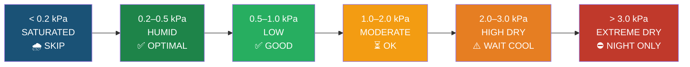
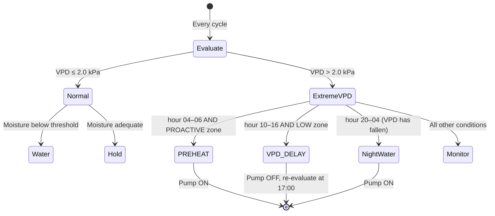
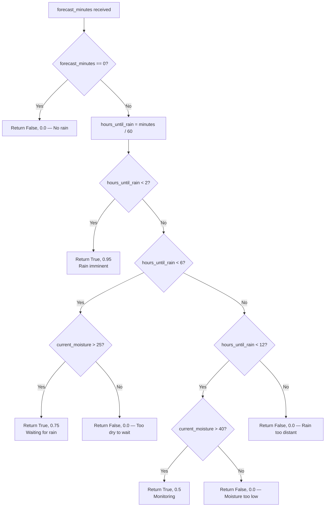
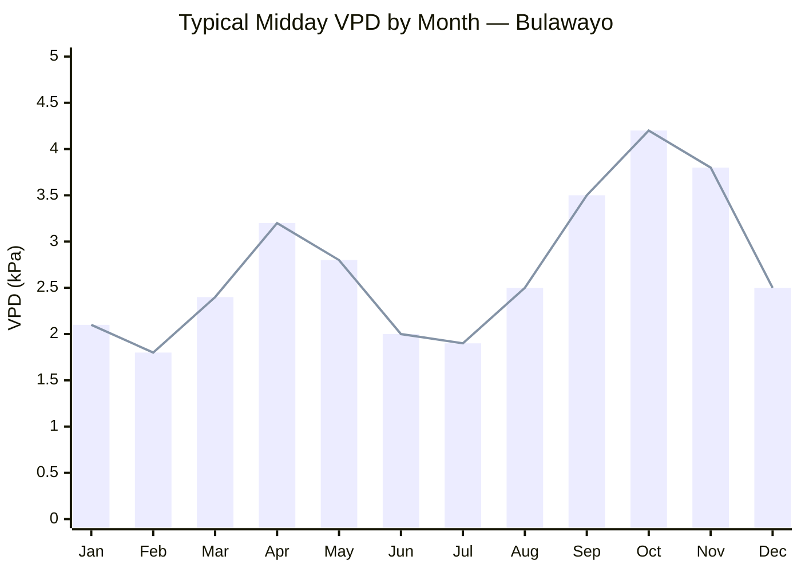

# VPD & Weather Engine

**The Definitive Technical Reference for Atmospheric Decision-Making in P-WOS**

> *This document describes how P-WOS translates raw atmospheric data — temperature, humidity, wind, and rain forecasts — into irrigation decisions. Every number, threshold, and formula is sourced directly from `ml_predictor.py` and `utils/vpd_calculator.py`.*

---

## Table of Contents

1. [What Is VPD?](#1-what-is-vpd)
2. [The 6 VPD Zones](#2-the-6-vpd-zones)
3. [Moisture Decay Rate Engine](#3-moisture-decay-rate-engine)
4. [The `is_extreme_vpd` Flag](#4-the-is_extreme_vpd-flag)
5. [The False Dry Detector](#5-the-false-dry-detector)
6. [Rain Confidence System](#6-rain-confidence-system)
7. [Weather Staleness Guard](#7-weather-staleness-guard)
8. [Optimal Watering Windows](#8-optimal-watering-windows)
9. [11 Real Weather Scenario Walkthroughs](#9-11-real-weather-scenario-walkthroughs)
10. [Zimbabwe Seasonal Context](#10-zimbabwe-seasonal-context)

---

## 1. What Is VPD?

### Plain English

The air around your plants is constantly trying to pull moisture out of the soil. How hard it pulls depends on how "thirsty" the air is — and VPD (**Vapor Pressure Deficit**) is the precise scientific measure of that thirst.

Think of it this way:
- **Saturated air** (100% relative humidity) is air that can't hold any more water. It has zero pulling power — VPD = 0.
- **Dry hot air** (e.g., 40 °C, 15% RH) is desperately hungry for moisture. It will strip water from soil, leaves, and roots with enormous force — VPD > 6.0 kPa.

**VPD is the difference between what the air *could* hold and what it *actually* holds**, expressed in kilopascals (kPa).

```
VPD = es (saturation vapor pressure) − ea (actual vapor pressure)
```

Higher VPD → faster evaporation → faster soil moisture loss → more urgent irrigation need.

---

### The Tetens Formula (Annotated)

P-WOS calculates VPD using the **Tetens approximation**, a meteorological standard accurate to within ±0.1% for agricultural temperature ranges. The implementation lives in `utils/vpd_calculator.py` and is called from `ml_predictor.py` line 232.

```python
# utils/vpd_calculator.py  (also ml_predictor.py line 232)

es = 0.6108 * exp((17.27 * T) / (T + 237.3))  # Saturation vapor pressure (kPa)
#    ^^^^^^                                         Magnus constant (kPa)
#             ^^^^^^^^^^^^^^^^^^^^^^^^^^^^^^^       Tetens exponent — nonlinear with temperature
#                         ^    ^^^^^^^              T = temperature in °C
#                                       ^^^^^^^     237.3 = Tetens empirical constant

ea = es * (RH / 100)                           # Actual vapor pressure (kPa)
#          ^^^^^^^^                               Relative humidity as a fraction [0–1]

VPD = max(0, es - ea)                          # Vapor Pressure Deficit (kPa)
#     ^^^^^^                                      Clamped: VPD can never be negative
```

**Why `max(0, ...)`?** In practice, sensors can report RH slightly above 100% during fog or rain, which would produce a negative VPD. The clamp ensures the system never interprets condensation conditions as negative evaporation.

---

### Worked VPD Calculations

| Condition | T (°C) | RH (%) | es (kPa) | ea (kPa) | **VPD (kPa)** |
|---|---|---|---|---|---|
| Bulawayo Summer midday | 36 | 20 | 5.94 | 1.19 | **4.75** |
| Bulawayo Summer storm | 25 | 95 | 3.17 | 3.01 | **0.16** |
| Bulawayo Winter sunny | 22 | 35 | 2.65 | 0.93 | **1.72** |
| Bulawayo Winter night | 4 | 55 | 0.81 | 0.45 | **0.37** |
| Spring windy | 30 | 25 | 4.24 | 1.06 | **3.18** |

> **Verification tip:** At 36 °C, `es = 0.6108 × exp((17.27 × 36)/(36 + 237.3)) = 0.6108 × exp(2.275) = 0.6108 × 9.727 ≈ 5.94 kPa`. At 20% RH: `ea = 5.94 × 0.20 = 1.19 kPa`. `VPD = 5.94 − 1.19 = 4.75 kPa`. ✓

---

## 2. The 6 VPD Zones

P-WOS classifies every atmospheric reading into one of six zones. The zone determines default strategy, expected decay rate, and which additional guards apply.

| Zone | VPD Range | Drying Power Label | Decay Rate | Time 60%→30% | System Strategy |
|---|---|---|---|---|---|
| **SATURATED** | < 0.2 kPa | Near-zero evaporation | < 0.5%/hr | > 60 hrs | 🌧️ SKIP — soil is not drying |
| **HUMID** | 0.2 – 0.5 kPa | Negligible pull | 0.5 – 2%/hr | 15 – 60 hrs | ✅ OPTIMAL — water absorbs slowly |
| **LOW** | 0.5 – 1.0 kPa | Gentle pull | 2 – 5%/hr | 6 – 15 hrs | ✅ GOOD — normal scheduling |
| **MODERATE** | 1.0 – 2.0 kPa | Noticeable evaporation | 5 – 10%/hr | 3 – 6 hrs | ⏳ OK — monitor closely |
| **HIGH DRY** | 2.0 – 3.0 kPa | Strong drying force | 10 – 20%/hr | 1.5 – 3 hrs | ⚠️ WAIT COOL — prefer evening/night |
| **EXTREME DRY** | > 3.0 kPa | Severe desiccation risk | 20 – 50%/hr | 0.5 – 1.5 hrs | ⛔ NIGHT ONLY — `is_extreme_vpd` flag triggers |

### Zone Transition Diagram



> **Key insight from vpd_scenarios.md:** Temperature alone does not determine the zone. At 35 °C / 70% RH, VPD = 1.69 kPa (MODERATE). At 28 °C / 25% RH, VPD = 2.83 kPa (HIGH DRY). **The warm-dry case dries soil nearly twice as fast as the hotter-but-humid case.**

---

## 3. Moisture Decay Rate Engine

### The Formula

The decay rate engine in `ml_predictor.py` (lines 91–101) computes how fast soil moisture is falling at a given moment, expressed as a multiplier on a base rate:

```python
# ml_predictor.py lines 91–101

def predict_decay_rate(self, temp, humidity, vpd, hour):
    base_decay = 0.5           # Base moisture loss rate (units/hour) at reference conditions

    # ── Temperature factor ───────────────────────────────────────────────────
    temp_factor = 1 + (temp - 25) * 0.08 if temp > 25 else 0.7
    #             ^                         Linear scaling above 25°C: +8% per degree
    #                                                  ^^^^^  Below 25°C: flat 0.7 (cold suppression)

    # ── VPD factor ───────────────────────────────────────────────────────────
    vpd_factor = 1 + (vpd * 0.4)
    #                 ^^^^^^^^^^^  Linear: every 1 kPa of VPD adds 40% to decay rate

    # ── Time-of-day factor ───────────────────────────────────────────────────
    time_factor = 1.0                           # Default: morning/afternoon shoulder
    if 10 <= hour <= 16: time_factor = 1.5      # Peak solar hours: 50% boost
    elif 22 <= hour or hour <= 4: time_factor = 0.3  # Deep night: 70% suppression

    return base_decay * temp_factor * vpd_factor * time_factor
```

### Component Breakdown

| Factor | Variable | Logic | Effect |
|---|---|---|---|
| **Base rate** | `base_decay = 0.5` | Fixed constant | Anchor for all multiplications |
| **Temperature** | `temp_factor` | `1 + (T−25)×0.08` if T > 25; else `0.7` | Cold days are capped at 0.7× |
| **VPD** | `vpd_factor` | `1 + vpd × 0.4` | Linearises VPD's drying power |
| **Time of day** | `time_factor` | 1.5 (10–16h), 0.3 (22h–04h), 1.0 (otherwise) | Solar radiation proxy |

### Regional Multiplier (line 338)

After `predict_decay_rate` returns, the result is scaled by a **regional multiplier** that captures soil type and climate zone:

```python
# ml_predictor.py line 338

decay_rate = self.predict_decay_rate(temp, humidity, vpd, now.hour) * region_mult
# region_mult values:
#   matabeleland  = 1.5   (sandy soils, very high evaporation — e.g., Bulawayo)
#   mashonaland   = 1.0   (reference — clay-loam, Harare)
#   manicaland    = 0.6   (highland, moist — e.g., Mutare, Nyanga)
```

**Final formula expanded:**

```
decay_rate = base_decay × temp_factor × vpd_factor × time_factor × region_mult
           = 0.5 × temp_factor × (1 + vpd × 0.4) × time_factor × region_mult
```

---

### Worked Examples

#### Scenario A — Hot Midday in Bulawayo (Summer Hot Dry)

**Inputs:** T = 36 °C, RH = 20%, VPD = 4.75 kPa, hour = 13, region = Matabeleland

```
temp_factor  = 1 + (36 - 25) × 0.08  = 1 + 0.88     = 1.88
vpd_factor   = 1 + (4.75 × 0.4)      = 1 + 1.90     = 2.90
time_factor  = 1.5                                    (peak solar: 10–16h)
region_mult  = 1.5                                    (Matabeleland)

decay_rate   = 0.5 × 1.88 × 2.90 × 1.5 × 1.5
             = 0.5 × 1.88 × 2.90 × 2.25
             = 0.5 × 12.26
             ≈ 6.13 units/hour
```

> At this rate, soil moisture drops ~6 units per hour. A zone starting at 60% could reach the 30% trigger level in under **5 hours**.

---

#### Scenario B — Warm Evening (Autumn Warm)

**Inputs:** T = 28 °C, RH = 45%, VPD = 2.08 kPa, hour = 19, region = Matabeleland

```
temp_factor  = 1 + (28 - 25) × 0.08  = 1 + 0.24     = 1.24
vpd_factor   = 1 + (2.08 × 0.4)      = 1 + 0.832    = 1.832
time_factor  = 1.0                                    (evening shoulder)
region_mult  = 1.5                                    (Matabeleland)

decay_rate   = 0.5 × 1.24 × 1.832 × 1.0 × 1.5
             = 0.5 × 3.411
             ≈ 1.71 units/hour
```

> Much more moderate. The system will water in the evening — VPD < 2.0 kPa means `is_extreme_vpd = 0` and no stalling applies.

---

#### Scenario C — Cool Night (Winter Night)

**Inputs:** T = 4 °C, RH = 55%, VPD = 0.37 kPa, hour = 02, region = Matabeleland

```
temp_factor  = 0.7                                    (T < 25: flat cold suppression)
vpd_factor   = 1 + (0.37 × 0.4)      = 1 + 0.148    = 1.148
time_factor  = 0.3                                    (deep night: 22h–04h)
region_mult  = 1.5                                    (Matabeleland)

decay_rate   = 0.5 × 0.7 × 1.148 × 0.3 × 1.5
             = 0.5 × 0.362
             ≈ 0.18 units/hour
```

> Practically negligible. The system effectively pauses irrigation scheduling during cold winter nights — soil barely dries, so watering would only waterlog cold roots.

---

### Decay Rate Summary Table

| Scenario | hour | temp_factor | vpd_factor | time_factor | region_mult | **decay_rate** |
|---|---|---|---|---|---|---|
| Summer Hot Dry (midday) | 13 | 1.88 | 2.90 | 1.5 | 1.5 | **6.13** |
| Autumn Warm (evening) | 19 | 1.24 | 1.83 | 1.0 | 1.5 | **1.71** |
| Winter Night | 02 | 0.70 | 1.15 | 0.3 | 1.5 | **0.18** |
| Spring Windy (midday) | 12 | 1.40 | 2.27 | 1.5 | 1.5 | **3.57** |
| Summer Storm (afternoon) | 14 | 1.00 | 1.06 | 1.5 | 1.5 | **1.19** |

---

## 4. The `is_extreme_vpd` Flag

### What Sets It

Two binary feature flags are computed during feature extraction (`ml_predictor.py` lines 236 and 248):

```python
# ml_predictor.py lines 236, 248

features['is_extreme_vpd'] = 1 if vpd > 2.0 else 0   # 1 = heatwave / severe drying risk
features['is_high_wind']   = 1 if wind_speed > 20 else 0  # 1 = wind-driven evaporation
```

**`is_extreme_vpd`** fires at `VPD > 2.0 kPa` — the boundary between MODERATE and HIGH DRY zones. Once set, it modifies the decision pipeline in two distinct ways depending on the moisture zone.

---

### Behaviour A — VPD_DELAY (LOW Moisture Zone, Midday)

When moisture is low (system is already considering watering urgently) *and* it is the hottest part of the day, watering is **deliberately stalled** to prevent wasteful surface evaporation. From `ml_predictor.py` lines 413–420:

```python
# ml_predictor.py lines 413–420

# In LOW moisture zone:
is_high_evap  = 10 <= now.hour <= 16        # Peak solar window
is_extreme_vpd = vpd > 2.0

if is_extreme_vpd and is_high_evap:
    decision = "STALL"
    status   = "VPD_DELAY"
    reason   = f"VPD extreme ({vpd:.2f}kPa) at midday. Stalling until evening."
```

**Effect:** The pump does not run. The system logs `VPD_DELAY` and waits for VPD to fall below 2.0 kPa (typically after 17:00–18:00) before re-evaluating.

**Why?** At VPD = 4.75 kPa (Summer Hot Dry), watering at 13:00 would see the top 20–30% of applied water evaporate before reaching root depth. Deferring to evening allows full absorption.

---

### Behaviour B — PREHEAT Watering (PROACTIVE Zone, Early Morning)

When moisture is in the PROACTIVE zone *and* the previous day or current forecast has flagged extreme VPD, the system waters aggressively in the pre-dawn window. From `ml_predictor.py` lines 429–433:

```python
# ml_predictor.py lines 429–433

# In PROACTIVE moisture zone:
is_morning = 4 <= now.hour <= 6

if is_morning and features.get('is_extreme_vpd', 0) == 1:
    decision = "NOW"
    status   = "PREHEAT"
    reason   = "Water pump is turned ON (Proactive morning top-up for hot day)."
```

**Effect:** The pump runs unconditionally during the 04:00–06:00 window when a hot day is predicted. This "pre-loads" the soil so that even if no further irrigation occurs until evening (due to VPD_DELAY), the plants have adequate reserves through the hottest hours.

---

### `is_extreme_vpd` State Machine



---

### VPD Threshold Summary

| Threshold | Value | Source | Triggers |
|---|---|---|---|
| `is_extreme_vpd` | VPD > 2.0 kPa | `ml_predictor.py:236` | VPD_DELAY, PREHEAT |
| Extreme zone lower | VPD > 3.0 kPa | `vpd_scenarios.md` | NIGHT ONLY strategy |
| Extreme zone upper (observed) | VPD > 4.75 kPa | Bulawayo Summer Hot Dry | Maximum regional value |
| `is_high_wind` | wind_speed > 20 | `ml_predictor.py:248` | False Dry Detector, features |

---

## 5. The False Dry Detector

### The Problem

Wind dramatically accelerates soil moisture sensor readings without necessarily reflecting true root-zone moisture. On a windy, low-humidity day, the top millimetre of soil can desiccate very quickly, causing the moisture sensor to report a sharp downward trend — even though the root zone is still adequately wet. Watering in response to this "false dry" signal wastes water and may contribute to shallow root systems.

---

### The Triple Condition

The false dry detector in `ml_predictor.py` (lines 127–131) fires when **all three** atmospheric conditions are simultaneously true:

```python
# ml_predictor.py lines 127–131

def detect_false_dry(self, wind_speed, humidity, change_rate):
    if wind_speed > 20 and humidity < 40 and change_rate < -0.5:
        #  ^^^^^^^^^^^^^^^^^^^^^^^^^^^^^^^^^^^^^^^^^^^^^^^^^^^^^^
        #  Condition 1: High wind speed (km/h) — mechanically strips moisture
        #  Condition 2: Low ambient humidity   — air is hungry for moisture
        #  Condition 3: Rapid sensor drop      — sensor reading falling fast
        return (True, "False dry suspected (High Wind/Low Hum).")
    return (False, "")
```

### Condition Analysis

| Condition | Threshold | Physical Meaning |
|---|---|---|
| **High wind** | `wind_speed > 20` (km/h) | Convective stripping at the soil-air boundary accelerates surface evaporation independently of VPD |
| **Low humidity** | `humidity < 40` (%) | Air is in HIGH DRY or EXTREME DRY zone — corroborates aggressive drying |
| **Rapid change** | `change_rate < -0.5` (%/min or units/cycle) | Sensor is dropping faster than any known root-zone depletion would cause |

**All three must fire simultaneously.** A windy day with 60% humidity does not trigger (humidity condition fails). A dry day with still air does not trigger (wind condition fails). The AND logic ensures the detector only fires when sensor drift is the most plausible explanation.

---

### System Response

When `detect_false_dry()` returns `(True, ...)`:

- Decision transitions to **`MONITOR`** or **`FALSE_DRY_CHECK`** status
- The pump is held off
- The system waits for a cross-validation against: (a) the wind subsiding, (b) humidity rising, or (c) an adjacent zone sensor confirming the reading
- The detection string `"False dry suspected (High Wind/Low Hum)."` is written to the decision log for operator review

**`FALSE_DRY_CHECK` vs `MONITOR`:**

| Status | Meaning |
|---|---|
| `FALSE_DRY_CHECK` | Detector fired with high confidence (all 3 conditions clearly exceeded) |
| `MONITOR` | Borderline case — one or more conditions marginal; system watches but does not act |

---

### False Dry in Bulawayo Context

The Spring Windy scenario (T = 30 °C, RH = 25%, wind = assumed > 20 km/h from `vpd_scenarios.md`) is the canonical false dry risk. VPD = 3.18 kPa means real drying is also occurring — the detector prevents over-reaction while the sensor sorts itself out.

---

## 6. Rain Confidence System

### Overview

Before issuing a WATER decision, P-WOS consults its rain confidence calculator. If rain is forecast, watering may be counterproductive — the system can defer and let natural rainfall do the work. The confidence calculation factors in both **how soon rain arrives** and **current moisture level** (deferring only makes sense if there's still enough soil moisture to bridge the gap).

---

### The Three-Window Algorithm

```python
# ml_predictor.py lines 103–119

def calculate_rain_confidence(self, forecast_minutes, current_moisture):
    if forecast_minutes == 0:
        return (False, 0.0, "")             # No rain in forecast — proceed normally

    hours_until_rain = forecast_minutes / 60.0

    # Window 1: IMMINENT RAIN (< 2 hours)
    if hours_until_rain < 2:
        return (True, 0.95, f"Rain imminent ({hours_until_rain:.1f}h).")
        # Confidence = 0.95 regardless of current moisture
        # Rationale: rain is essentially certain within 2h — never water

    # Window 2: NEAR-TERM RAIN (2–6 hours)
    elif hours_until_rain < 6:
        if current_moisture > 25:
            return (True, 0.75, f"Rain in {hours_until_rain:.1f}h. Waiting.")
        # If moisture ≤ 25: fall through → (False, 0.0, "") — water anyway (too dry to wait)

    # Window 3: MEDIUM-TERM RAIN (6–12 hours)
    elif hours_until_rain < 12:
        if current_moisture > 40:
            return (True, 0.5, f"Rain in {hours_until_rain:.1f}h. Monitoring.")
        # If moisture ≤ 40: fall through → (False, 0.0, "") — water anyway (can't wait 12h)

    return (False, 0.0, "")                 # Rain too far away, or moisture too low to defer
```

---

### Three-Window Reference Table

| Window | Hours Until Rain | Moisture Cutoff | Defer? | Confidence | Status Message |
|---|---|---|---|---|---|
| **IMMINENT** | < 2h | None (always defer) | ✅ YES | **0.95** | `Rain imminent (Xh).` |
| **NEAR-TERM** | 2h – 6h | > 25% | ✅ YES | **0.75** | `Rain in Xh. Waiting.` |
| **NEAR-TERM** | 2h – 6h | ≤ 25% | ❌ NO | 0.0 | — Water immediately |
| **MEDIUM-TERM** | 6h – 12h | > 40% | ✅ YES | **0.50** | `Rain in Xh. Monitoring.` |
| **MEDIUM-TERM** | 6h – 12h | ≤ 40% | ❌ NO | 0.0 | — Water immediately |
| **DISTANT / NONE** | ≥ 12h or 0 | Any | ❌ NO | 0.0 | — Proceed normally |

---

### Decision Logic Flowchart



---

### Design Rationale

The moisture cutoffs create asymmetric behaviour:

- **Near-term rain (2–6h):** Plants need moisture `> 25%` to safely wait 6 hours. Below that, stress risk is too high.
- **Medium-term rain (6–12h):** A 12-hour wait requires `> 40%` reserves. At 35% moisture, a plant in a VPD = 3.0 kPa environment could lose 10–15 units before rain arrives — risk is unacceptable.

Confidence scores (0.95, 0.75, 0.50) are passed to the ML model as features, allowing it to weight rain deferral against other signals like soil moisture urgency.

---

## 7. Weather Staleness Guard

### The Problem

P-WOS relies on weather API data for VPD calculation, wind speed, rain forecasting, and intensity. If the API connection fails, returns cached data that's hours old, or falls back to a default, the weather inputs become unreliable. Acting on stale weather data can cause:

- Incorrect VPD → wrong decay rate → wrong irrigation timing
- False rain forecasts → unjustified watering deferrals
- Missing wind data → false dry detector blind

---

### The Staleness Zero-Out

`ml_predictor.py` lines 252–258 apply a **defensive zero-out** whenever the weather source is not fresh:

```python
# ml_predictor.py lines 252–258

if weather_source in ('stale', 'fallback', 'none'):
    features['forecast_minutes'] = 0      # No rain deferral — treat as no rain forecast
    features['wind_speed']       = 0.0   # No wind data — false dry detector disabled
    features['rain_intensity']   = 0.0   # No current rain info
    features['is_raining']       = 0     # Assume not raining
    features['is_high_wind']     = 0     # Assume calm — conservative
```

---

### What Each Zero-Out Means

| Feature Zeroed | Effect on Decisions | Conservative Bias |
|---|---|---|
| `forecast_minutes = 0` | Rain confidence returns `(False, 0.0, "")` — system never defers for rain | Safe (will water if needed) |
| `wind_speed = 0.0` | False dry detector cannot fire (`wind_speed > 20` always fails) | Safe (won't suppress valid readings) |
| `rain_intensity = 0.0` | System doesn't know if it's currently raining | Slightly risky (may water during rain) |
| `is_raining = 0` | System assumes no current precipitation | Slightly risky |
| `is_high_wind = 0` | `is_high_wind` ML feature set to 0 | Conservative (model underestimates evaporation) |

---

### Weather Source Classification

| `weather_source` Value | Meaning | Guard Applied? |
|---|---|---|
| `'live'` | Fresh API data < threshold age | ❌ No — full data used |
| `'cached'` | Recent cache, within acceptable window | ❌ No — data still valid |
| `'stale'` | Cache too old (configurable, typically > 1–2 hours) | ✅ **Yes — zero-out applied** |
| `'fallback'` | Default values substituted (no API response) | ✅ **Yes — zero-out applied** |
| `'none'` | No weather module configured | ✅ **Yes — zero-out applied** |

---

### Impact on Decision Quality

With staleness guard active, the system operates in a **moisture-first mode**: it uses only the sensor readings and time-of-day to make decisions. VPD is still calculated from temperature/humidity (if those sensors are local), but:

- No rain deferral occurs
- No false dry suppression occurs
- Decay rate calculation continues (temp/humidity are usually local sensors)
- `is_high_wind` is suppressed, slightly underestimating evaporation risk

This is the correct tradeoff: **the system may water slightly more than needed but will not fail to water when plants need it.**

---

## 8. Optimal Watering Windows

The interaction between time of day and VPD creates distinct watering windows. These align directly with the `time_factor` multipliers in the decay rate engine and the `is_extreme_vpd` guard.

*Source: vpd_scenarios.md — Optimal Watering Times table + ml_predictor.py time_factor logic.*

### For Hot Days (is_extreme_vpd = 1, VPD > 2.0 kPa predicted)

| Time Window | Typical VPD | `time_factor` | System Behaviour | Rating |
|---|---|---|---|---|
| **04:00 – 06:00** | 0.3 – 0.5 kPa | 0.3 (deep night) | PREHEAT trigger active | ✅ **BEST** |
| 06:00 – 08:00 | 0.5 – 1.0 kPa | 1.0 (shoulder) | Normal scheduling | ✅ GOOD |
| 08:00 – 10:00 | 1.0 – 2.0 kPa | 1.0 (shoulder) | VPD approaching threshold | ⚠️ OK |
| **10:00 – 16:00** | 2.0 – 5.0+ kPa | **1.5** (peak solar) | VPD_DELAY active if is_extreme_vpd | ⛔ **AVOID** |
| 16:00 – 18:00 | 2.0 – 3.0 kPa | 1.0 (shoulder) | VPD still often > 2.0 | ⚠️ CAUTION |
| **18:00 – 20:00** | 1.0 – 2.0 kPa | 1.0 (shoulder) | VPD_DELAY lifted, water absorbs | ✅ GOOD |
| **20:00 – 04:00** | 0.3 – 0.8 kPa | 0.3 (deep night) | Optimal absorption all night | ✅ **OPTIMAL** |

---

### The PREHEAT–DELAY–NIGHT Cycle

On a Bulawayo summer day, a typical P-WOS run looks like this:

```mermaid
gantt
    title Irrigation Decision Cycle — Summer Hot Dry Day (VPD > 2.0 predicted)
    dateFormat HH:mm
    axisFormat %H:%M

    section Pump Activity
    PREHEAT run         : active,  04:00, 06:00
    Hold - VPD rising   :          06:00, 10:00
    VPD_DELAY stall     : crit,    10:00, 17:00
    VPD_DELAY lifted    :          17:00, 18:00
    Evening water run   : active,  18:00, 20:00
    Optimal night runs  : active,  20:00, 04:00

    section VPD Level
    Low VPD 0.3-0.5 kPa    :       04:00, 06:00
    Rising VPD              :       06:00, 10:00
    Extreme VPD (>2.0 kPa) : crit, 10:00, 17:00
    Falling VPD             :       17:00, 20:00
    Low VPD night           :       20:00, 04:00
```



---

## 9. 11 Real Weather Scenario Walkthroughs

Each scenario traces the complete P-WOS decision pipeline from raw weather inputs through to the final status. All scenarios use Bulawayo, Zimbabwe data from `vpd_scenarios.md`.

**Assumptions for all walkthroughs:**
- Region: Matabeleland (`region_mult = 1.5`)
- Starting soil moisture unless stated: 35% (LOW zone, below field capacity)
- Weather source: `'live'` (staleness guard inactive)
- No rain forecast unless stated

---

### Scenario 1 — SUMMER HOT DRY

**Inputs:** T = 36 °C, RH = 20%, VPD = 4.75 kPa, hour = 13:00, wind = 8 km/h

```
VPD Calculation:
  es = 0.6108 × exp(17.27×36/(36+237.3)) = 5.94 kPa
  ea = 5.94 × 0.20 = 1.19 kPa
  VPD = 4.75 kPa ✓

Feature flags:
  is_extreme_vpd = 1     (VPD 4.75 > 2.0)
  is_high_wind   = 0     (wind 8 < 20)

False Dry check:
  wind_speed=8 → 8 > 20? NO → detector does not fire

Decay rate:
  temp_factor  = 1 + (36-25)×0.08 = 1.88
  vpd_factor   = 1 + 4.75×0.4     = 2.90
  time_factor  = 1.5               (hour 13 in 10–16)
  decay_rate   = 0.5 × 1.88 × 2.90 × 1.5 × 1.5 = 6.13

Rain confidence: forecast_minutes=0 → (False, 0.0, "")

Decision path:
  Moisture zone = LOW (35%)
  is_extreme_vpd AND is_high_evap (10≤13≤16) → VPD_DELAY triggered
```

**Result:** `decision=STALL, status=VPD_DELAY`
*"VPD extreme (4.75kPa) at midday. Stalling until evening."*

---

### Scenario 2 — SUMMER HOT DRY (Pre-dawn)

**Same conditions but hour = 05:00, moisture zone = PROACTIVE (48%)**

```
is_extreme_vpd = 1     (forecast VPD for the coming day)
is_morning     = True  (4 ≤ 5 ≤ 6)
Zone = PROACTIVE

→ PREHEAT condition fires
```

**Result:** `decision=NOW, status=PREHEAT`
*"Water pump is turned ON (Proactive morning top-up for hot day)."*

---

### Scenario 3 — SUMMER HOT HUMID

**Inputs:** T = 32 °C, RH = 65%, VPD = 1.66 kPa, hour = 14:00, moisture = 35%

```
VPD Calculation:
  es = 0.6108 × exp(17.27×32/(32+237.3)) = 4.76 kPa
  ea = 4.76 × 0.65 = 3.09 kPa
  VPD = 1.66 kPa ✓

Feature flags:
  is_extreme_vpd = 0     (VPD 1.66 ≤ 2.0)
  is_high_wind   = 0

False Dry check: wind ≤ 20 → no fire

Decay rate:
  temp_factor  = 1 + (32-25)×0.08 = 1.56
  vpd_factor   = 1 + 1.66×0.4     = 1.664
  time_factor  = 1.5
  decay_rate   = 0.5 × 1.56 × 1.664 × 1.5 × 1.5 = 2.92

Decision path:
  is_extreme_vpd = 0 → VPD_DELAY does NOT fire
  Moisture LOW (35%) → standard scheduling → evaluate urgency
```

**Result:** `decision=WATER, status=OK` — System waters. VPD < 2.0 means acceptable efficiency, though not ideal.
*Strategy: ⚠️ WAIT COOL from vpd_scenarios.md — system may schedule a short run and prefer to finish by 16:00.*

---

### Scenario 4 — SUMMER STORM

**Inputs:** T = 25 °C, RH = 95%, VPD = 0.16 kPa, hour = 15:00, forecast_minutes = 20

```
VPD Calculation:
  es = 0.6108 × exp(17.27×25/(25+237.3)) = 3.17 kPa
  ea = 3.17 × 0.95 = 3.01 kPa
  VPD = 0.16 kPa → Zone: SATURATED

Feature flags:
  is_extreme_vpd = 0
  is_raining likely = 1 (95% RH, storm conditions)

Rain confidence:
  hours_until_rain = 20/60 = 0.33h < 2h
  → (True, 0.95, "Rain imminent (0.3h).")

Decay rate:
  temp_factor  = 0.7   (T=25, not > 25)
  vpd_factor   = 1 + 0.16×0.4 = 1.064
  time_factor  = 1.5
  decay_rate   = 0.5 × 0.7 × 1.064 × 1.5 × 1.5 = 0.84 (very low)
```

**Result:** `decision=STALL, status=RAIN_WAIT`
Rain confidence 0.95 — system skips entirely. Rain arrives within 20 minutes and replenishes freely.

---

### Scenario 5 — SUMMER NIGHT

**Inputs:** T = 22 °C, RH = 80%, VPD = 0.53 kPa, hour = 22:00, moisture = 38%

```
VPD = 0.53 kPa → Zone: LOW (near HUMID boundary)
is_extreme_vpd = 0

Decay rate:
  temp_factor  = 0.7   (T=22, not > 25)
  vpd_factor   = 1 + 0.53×0.4 = 1.212
  time_factor  = 0.3   (hour 22: deep night)
  decay_rate   = 0.5 × 0.7 × 1.212 × 0.3 × 1.5 = 0.19

Rain confidence: no forecast → (False, 0.0, "")
```

**Result:** `decision=NOW, status=OK`
Cool, humid, night. VPD is low, decay is minimal — soil absorbs water efficiently with no evaporation loss. Optimal window per vpd_scenarios.md 20:00–04:00 table.

---

### Scenario 6 — AUTUMN WARM

**Inputs:** T = 28 °C, RH = 45%, VPD = 2.08 kPa, hour = 14:00, moisture = 35%

```
VPD = 2.08 kPa → is_extreme_vpd = 1 (just over 2.0)

is_high_evap = True (10 ≤ 14 ≤ 16)
→ VPD_DELAY fires

Decay rate:
  temp_factor  = 1 + (28-25)×0.08 = 1.24
  vpd_factor   = 1 + 2.08×0.4     = 1.832
  time_factor  = 1.5
  decay_rate   = 0.5 × 1.24 × 1.832 × 1.5 × 1.5 = 2.57
```

**Result:** `decision=STALL, status=VPD_DELAY`
*"VPD extreme (2.08kPa) at midday. Stalling until evening."*
VPD barely clears the 2.0 kPa threshold — the DELAY is still warranted. System re-evaluates at ~17:00 when VPD typically falls below 2.0 as temperature drops.

---

### Scenario 7 — AUTUMN NIGHT

**Inputs:** T = 14 °C, RH = 65%, VPD = 0.56 kPa, hour = 02:00, moisture = 32%

```
VPD = 0.56 kPa → Zone: LOW
is_extreme_vpd = 0

Decay rate:
  temp_factor  = 0.7   (T < 25)
  vpd_factor   = 1 + 0.56×0.4 = 1.224
  time_factor  = 0.3
  decay_rate   = 0.5 × 0.7 × 1.224 × 0.3 × 1.5 = 0.19

Moisture = 32% → LOW zone → watering justified
```

**Result:** `decision=NOW, status=OK`
Ideal night-time watering. Minimal decay (0.19 units/hr), soil absorbs all applied water before morning.

---

### Scenario 8 — WINTER COLD DRY

**Inputs:** T = 10 °C, RH = 30%, VPD = 0.86 kPa, hour = 10:00, moisture = 38%

```
VPD = 0.86 kPa → Zone: LOW
is_extreme_vpd = 0

Decay rate:
  temp_factor  = 0.7   (T < 25)
  vpd_factor   = 1 + 0.86×0.4 = 1.344
  time_factor  = 1.5   (hour 10 in peak solar window)
  decay_rate   = 0.5 × 0.7 × 1.344 × 1.5 × 1.5 = 1.06
```

**Result:** `decision=OK` — System may water during the day in winter. VPD < 2.0 means no stalling; cold temperatures suppress decay even at midday. Strategy: ✅ OK per vpd_scenarios.md.

---

### Scenario 9 — WINTER SUNNY

**Inputs:** T = 22 °C, RH = 35%, VPD = 1.72 kPa, hour = 12:00, moisture = 35%

```
VPD = 1.72 kPa → Zone: MODERATE
is_extreme_vpd = 0  (1.72 < 2.0 — does NOT trigger delay)

Decay rate:
  temp_factor  = 0.7   (T=22, not > 25)
  vpd_factor   = 1 + 1.72×0.4 = 1.688
  time_factor  = 1.5
  decay_rate   = 0.5 × 0.7 × 1.688 × 1.5 × 1.5 = 1.33
```

**Result:** `decision=OK / WATER`
Winter sunny days are within safe irrigation range even at midday. VPD 1.72 stays just below the extreme flag. *vpd_scenarios.md: ⚠️ WAIT COOL — system may prefer afternoon or evening but will not hard-stall.*

---

### Scenario 10 — WINTER NIGHT

**Inputs:** T = 4 °C, RH = 55%, VPD = 0.37 kPa, hour = 02:00, moisture = 36%

```
VPD = 0.37 kPa → Zone: HUMID
is_extreme_vpd = 0

Decay rate:
  temp_factor  = 0.7
  vpd_factor   = 1 + 0.37×0.4 = 1.148
  time_factor  = 0.3
  decay_rate   = 0.5 × 0.7 × 1.148 × 0.3 × 1.5 = 0.18
```

**Result:** `decision=HOLD / LOW URGENCY`
Decay rate of 0.18 means moisture barely moves overnight. Even at 36%, the system may defer to a more energy-efficient morning run rather than running the pump at 02:00 in winter. Strategy: ✅ GOOD per vpd_scenarios.md.

---

### Scenario 11 — SPRING WINDY

**Inputs:** T = 30 °C, RH = 25%, VPD = 3.18 kPa, hour = 12:00, wind = 28 km/h, moisture = 38%, change_rate = -0.8

```
VPD Calculation:
  es = 0.6108 × exp(17.27×30/(30+237.3)) = 4.24 kPa
  ea = 4.24 × 0.25 = 1.06 kPa
  VPD = 3.18 kPa ✓

Feature flags:
  is_extreme_vpd = 1     (VPD 3.18 > 2.0)
  is_high_wind   = 1     (wind 28 > 20)

False Dry detection:
  wind_speed=28 > 20?        YES ✓
  humidity=25 < 40?          YES ✓
  change_rate=-0.8 < -0.5?   YES ✓
  → ALL THREE conditions met → (True, "False dry suspected (High Wind/Low Hum).")

Decision conflict:
  VPD_DELAY fires (is_extreme_vpd AND 10≤12≤16)
  False Dry also fires (independent path)
  → Both agree: do not water
```

**Result:** `decision=STALL, status=FALSE_DRY_CHECK`
Both VPD_DELAY and the False Dry detector fire simultaneously. The system is doubly confident: even if the moisture reading is accurate, VPD is too high to water efficiently. If the moisture is false-low, watering is also wrong. Pump stays off. Re-evaluation at ~17:00 when wind and temperature may subside.

---

### Scenario Summary Matrix

| # | Scenario | VPD | is_extreme_vpd | Hour | Decision | Status |
|---|---|---|---|---|---|---|
| 1 | Summer Hot Dry (midday) | 4.75 | 1 | 13 | STALL | VPD_DELAY |
| 2 | Summer Hot Dry (pre-dawn) | 4.75 (forecast) | 1 | 05 | NOW | PREHEAT |
| 3 | Summer Hot Humid | 1.66 | 0 | 14 | WATER | OK |
| 4 | Summer Storm | 0.16 | 0 | 15 | STALL | RAIN_WAIT |
| 5 | Summer Night | 0.53 | 0 | 22 | NOW | OK |
| 6 | Autumn Warm | 2.08 | 1 | 14 | STALL | VPD_DELAY |
| 7 | Autumn Night | 0.56 | 0 | 02 | NOW | OK |
| 8 | Winter Cold Dry | 0.86 | 0 | 10 | OK | WATER |
| 9 | Winter Sunny | 1.72 | 0 | 12 | OK | WATER |
| 10 | Winter Night | 0.37 | 0 | 02 | HOLD | LOW URGENCY |
| 11 | Spring Windy | 3.18 | 1 | 12 | STALL | FALSE_DRY_CHECK |

---

## 10. Zimbabwe Seasonal Context

### Why VPD Patterns Differ by Season

Zimbabwe's agricultural VPD cycle is driven by the **Intertropical Convergence Zone (ITCZ)**, which migrates south in summer bringing moisture from the Indian Ocean and Mozambique Channel, and retreats north in winter leaving the country under dry continental airflows.

The two primary seasons that P-WOS must navigate are structurally opposite in their atmospheric behaviour:

---

### Summer: November – March (Hot & Wet Season)

| Characteristic | Typical Range | VPD Implication |
|---|---|---|
| Daytime temperature | 28 – 38 °C | High `es` (saturation pressure) |
| Relative humidity (daytime) | 40 – 80% | High `ea`, partially offsets `es` |
| Relative humidity (during storms) | 85 – 98% | VPD collapses to < 0.2 kPa |
| Rainfall pattern | Convective — afternoon thunderstorms | forecast_minutes = 60–180 most afternoons |
| Wind | Variable, often calm before storms | Low false dry risk except hot dry spells |
| VPD range (daytime) | 0.16 – 4.75 kPa | **Widest range of the year** |

**Key summer challenge:** The same day can move from `PREHEAT` at 05:00 (VPD 0.4 kPa) → `VPD_DELAY` at 13:00 (VPD 4.75 kPa) → `RAIN_WAIT` at 15:00 (VPD 0.16 kPa). The system must adapt within hours, not days.

**Summer irrigation strategy:**
- PREHEAT runs (04:00–06:00) are the primary irrigation window
- Afternoon storms provide free water 3–4 times per week (December–February)
- Rain confidence system is exercised daily
- `is_extreme_vpd` flag fires regularly — VPD_DELAY is the norm, not exception

---

### Dry Season: May – September (Cool & Dry Season)

| Characteristic | Typical Range | VPD Implication |
|---|---|---|
| Daytime temperature | 15 – 28 °C | Moderate `es` |
| Relative humidity (daytime) | 20 – 45% | Low `ea` — significant VPD despite lower temp |
| Relative humidity (night) | 40 – 65% | VPD stays moderate even at night |
| Rainfall pattern | Essentially none | forecast_minutes = 0 always |
| Wind | Dry southerly winds common | False dry risk elevated (especially Sept) |
| VPD range (daytime) | 0.86 – 3.18 kPa | Elevated despite cooler temperatures |

**Key winter challenge:** The **HOT ≠ DRY** principle from vpd_scenarios.md is critical here. At 22 °C / 35% RH (Winter Sunny), VPD = 1.72 kPa — higher than many summer storm conditions. The system must water more frequently than the mild temperatures alone suggest, because the dry air is continuously pulling moisture from soil.

**Winter irrigation strategy:**
- No afternoon storms → rain confidence never defers → system waters on moisture triggers alone
- `temp_factor = 0.7` for all T < 25°C readings — reduces urgency calculation
- `time_factor = 1.5` still applies at midday — winter sun still drives evaporation
- September (Spring Windy) is the highest false dry risk month — hot winds, very low humidity
- Night runs still preferred but less time-sensitive than summer (decay rate 0.18 vs 6.13)

---

### Seasonal VPD Comparison Chart



*Note: Values represent illustrative midday VPD estimates derived from the seasonal temperature and humidity patterns in vpd_scenarios.md. Jan–Mar: wet season variability. May–Aug: dry season with moderate VPD despite cool temps. Sep–Oct: spring peak — highest VPD of year. Nov–Dec: early rains lower VPD from October peak.*

---

### Seasonal Decision Frequency

| Season | VPD_DELAY frequency | PREHEAT frequency | RAIN_WAIT frequency | False Dry risk |
|---|---|---|---|---|
| **Nov – Mar (Summer)** | High (daily) | High (hot day forecasts) | High (storms) | Low–Medium |
| **Apr (Autumn)** | Medium | Medium | Low | Low |
| **May – Aug (Winter)** | Low | None | None | Low |
| **Sep – Oct (Spring)** | Medium–High | Medium | None | **HIGH** |

---

### Region × Season Interaction

The regional multiplier (`region_mult`) compounds seasonal effects:

```
Matabeleland (region_mult = 1.5) — Bulawayo
  Summer Hot Dry midday:  decay = 6.13 units/hr  (CRITICAL)
  Winter sunny midday:    decay = 1.00 units/hr  (MODERATE)

Manicaland (region_mult = 0.6) — Mutare/Nyanga
  Summer Hot Dry midday:  decay = 2.45 units/hr  (MANAGEABLE)
  Winter sunny midday:    decay = 0.40 units/hr  (NEGLIGIBLE)
```

Manicaland's highland moisture retention effectively halves the irrigation urgency in all seasons. A Bulawayo PREHEAT trigger at 05:00 would not fire for the same zone in Nyanga — the PROACTIVE threshold may not even be reached overnight given the lower decay rate.

---

## Quick Reference Thresholds

| Parameter | Threshold | Source | Triggered By |
|---|---|---|---|
| Extreme VPD | > 2.0 kPa | `ml_predictor.py:236` | `is_extreme_vpd = 1` |
| High wind | > 20 km/h | `ml_predictor.py:248` | `is_high_wind = 1` |
| Peak solar | 10:00 – 16:00 | `ml_predictor.py:95` | `time_factor = 1.5` |
| Deep night | 22:00 – 04:00 | `ml_predictor.py:96` | `time_factor = 0.3` |
| PREHEAT window | 04:00 – 06:00 | `ml_predictor.py:429` | PREHEAT status |
| False dry: wind | > 20 km/h | `ml_predictor.py:127` | Condition 1 of 3 |
| False dry: humidity | < 40% | `ml_predictor.py:127` | Condition 2 of 3 |
| False dry: change | < −0.5 | `ml_predictor.py:127` | Condition 3 of 3 |
| Rain imminent | < 2h | `ml_predictor.py:107` | Confidence 0.95 |
| Rain near-term | 2–6h, moisture > 25% | `ml_predictor.py:109-111` | Confidence 0.75 |
| Rain medium-term | 6–12h, moisture > 40% | `ml_predictor.py:113-115` | Confidence 0.50 |
| Matabeleland mult | 1.5× | `ml_predictor.py:338` | Bulawayo region |
| Mashonaland mult | 1.0× | `ml_predictor.py:338` | Harare region |
| Manicaland mult | 0.6× | `ml_predictor.py:338` | Mutare/Nyanga region |

---

*P-WOS v2.0 | System Behaviour — VPD & Weather Engine*
