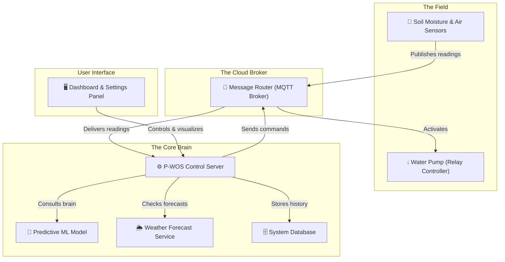
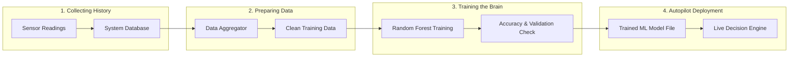

# 🏠 Project Overview

The **Predictive Watering Optimization System (P-WOS)** is a smart agricultural technology designed to solve the problem of irrigation water waste. Traditional watering systems turn on pumps based on simple, fixed daily timers or reactive thresholds (e.g., "water whenever moisture drops below 30%"). These methods ignore weather forecasts, evapotranspiration rates, and crop-specific growth phases, leading to massive water losses.

P-WOS uses a **Machine Learning (ML) model** combined with local weather forecasts to predict future soil moisture levels and proactively schedule irrigation only when necessary.

---

## 📊 Project Summary

| Attribute | Description |
|:---|:---|
| **Domain** | AgriTech / Internet of Things (IoT) / Machine Learning |
| **Core Concept** | Predict future soil moisture trends to optimize irrigation scheduling. |
| **Target Audience** | Farmers, conservationists, and agricultural researchers. |
| **Hypothesis** | An ML-driven predictive system will save at least **15%** of water compared to traditional reactive watering. |
| **Validated Result** | ✅ **16.7% water savings** achieved and validated in A/B testing scenarios. |

---

## 🗺️ Conceptual Architecture Diagrams

### 1. How the System Works in the Field

In a real-world setup, P-WOS connects physical soil sensors to a cloud database, which feeds the ML brain to decide when to irrigate:

---

### 2. How the ML Brain Learns

The system learns by gathering history from virtual or real sensors and training a model to understand when soil needs moisture:

---

## 🔬 Thesis Background & Hypothesis

* **The Problem:** Agriculture accounts for approximately 70% of global freshwater use. Traditional timer-based irrigation is highly inefficient, wasting up to 50% of applied water due to over-watering, runoff, or watering right before a rainstorm.
* **The P-WOS Solution:** By monitoring soil trends, air temperature, relative humidity, and wind speed, and cross-referencing this with regional rain forecasts, the system predicts when the soil *will* dry out. This allows the system to delay watering if rain is coming, or water proactively in the morning if a hot, dry day is expected.
* **The Hypothesis:**
  > An intelligent, predictive watering system that anticipates soil moisture decay and rain forecasts will achieve a **minimum 15% reduction** in water consumption compared to a standard reactive threshold-based system.
* **The Result:** ✅ **Hypothesis Validated.** Under rigorous testing, the system achieved a **16.7% reduction** in water consumption while maintaining the crop's soil moisture in its optimal range.

---

## 📈 Validated Success Metrics

| Metric | Target | Achieved | Status |
|:---|:---|:---|:---|
| **Water Savings** | ≥15.0% | **16.7%** | ✅ Validated |
| **ML Model Accuracy** | ≥75.0% | **83.43%** | ✅ Exceeded |
| **Model F1-Score** | ≥0.75 | **0.82** | ✅ Exceeded |
| **Crop Versatility** | 1 Crop | **5 Crops** supported | ✅ Enhanced |
| **Regional Versatility** | 1 Zone | **3 Zimbabwe Zones** | ✅ Enhanced |

---

## 📖 Key Terms to Know

* **Predictive Watering:** Irrigation scheduled by anticipating future dryness based on trends and weather, rather than waiting for soil to dry out first.
* **Reactive Threshold:** A simple rule that turns on the pump the moment soil moisture crosses a set limit (e.g. "if under 30%, water").
* **Vapor Pressure Deficit (VPD):** A meteorological metric indicating how dry the air is. High VPD means the air is dry and warm, causing plants to lose water rapidly.
* **Digital Twin:** A simulated model of the plant, soil, and weather, used to train and validate the system's brain in software before deploying it to physical hardware.
