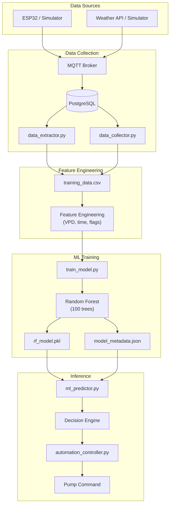
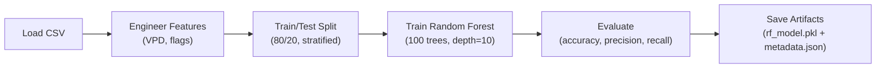

# ML Model Guide & Architecture

**P-WOS Machine Learning — How the System Thinks**

---

## Overview

P-WOS uses a **Random Forest Classifier** to predict whether a plant will need watering in the next 24 hours. The model is **crop-aware and region-aware** — it includes agronomic parameters for 5 Zimbabwean crops across 3 agro-ecological regions. It works alongside a rule-based **Decision Engine** that converts raw ML predictions into actionable pump commands (NOW, STALL, STOP, MONITOR).

```
┌─────────────────────────────────────────────────────────────────┐
│                     P-WOS AI PIPELINE (v3.0)                     │
│                                                                 │
│  Sensors + Crop   Features  ML Model  Decision Engine Pump Action │
│  & Region Info    → 12 feat  → RF       → Rule-Based    → NOW/STALL/ │
│                            630k samp  (VPD + Weather)   STOP/MONITOR │
└─────────────────────────────────────────────────────────────────┘
```

### Current Model Performance

| Metric | Value |
|--------|-------|
| **Accuracy** | 83.43% |
| **Precision** (Class 1) | 96% |
| **Recall** (Class 1) | 72% |
| **F1-Score** (Class 1) | 82% |
| **Model Type** | RandomForestClassifier |
| **Estimators** | 100 trees, max_depth=10 |
| **Training Samples** | 504,000 (80% of 630k) |
| **Testing Samples** | 126,000 (20% of 630k) |
| **Model Size** | ~2.3 MB (`rf_model.pkl`) |

---

## Architecture



---

## The 4-Phase ML Pipeline

### Phase 1: Data Collection
Data flows from sensors through MQTT into PostgreSQL, then gets extracted into CSV for training.

```
ESP32/Simulator → MQTT → app.py (on_message) → PostgreSQL
                                                    ↓
                                            data_extractor.py
                                                    ↓
                                         real_training_data.csv
```

#### Two Data Collection Paths

| Path | File | Source | Use Case |
|------|------|--------|----------|
| **Legacy** | `data_collector.py` | SQLite simulation DB | Initial training with synthetic data |
| **Production** | `data_extractor.py` | PostgreSQL live DB | Retraining with real sensor data |

---

### Phase 2: Feature Engineering & Context Injection
The model combines physical sensor data with agronomic settings context:
*   **Settings Injection**: Passes crop thresholds (`crop_critical_moisture`, `crop_target_moisture`) and regional factors (`region_evap_multiplier`) in-memory.
*   **Atmospheric Physics**: Computes Air drying demand (Vapour Pressure Deficit) using temperature and humidity curves.

*(For detailed math and feature definitions, see the [Feature Engineering & Physics Calculations](feature_engineering.md) guide).*

---

### Phase 3: Model Training
The model is trained using scikit-learn's Random Forest classifier:



#### Hyperparameters
```python
RandomForestClassifier(
    n_estimators=100,       # 100 decision trees
    max_depth=10,           # Max tree depth (prevents overfitting)
    random_state=42,        # Reproducible results
    class_weight='balanced', # Handles class imbalance
    n_jobs=-1               # Use all CPU cores
)
```

#### Why Random Forest?
*   **Robustness**: Handles multi-modal and tabular datasets (categorical + numeric) natively.
*   **Low Latency**: Inference executes in **< 1ms**, fitting within our 5-second autopilot tick budget.
*   **Interpretability**: Provides feature importance rankings, allowing developers to inspect how decisions are made.

---

### Phase 4: Inference & Decision Engine
```bash
# API endpoint
GET /api/predict-next-watering
```
The prediction pipeline runs in two stages:
1.  **ML Prediction**: Random Forest evaluates the current state and returns `needs_watering_soon` probability.
2.  **Rule Safety Check**: Decision engine maps this prediction to rules (storms, peak heat limits, critical dryness floors) to output `NOW`, `STALL`, `STOP`, or `MONITOR`.

---

## File Reference

| File | Purpose |
|------|---------|
| [`ml_predictor.py`](../../../src/backend/models/ml_predictor.py) | `MLPredictor` class — feature prep, inference, decision engine |
| [`train_model.py`](../../../src/backend/models/train_model.py) | Training script — load CSV, engineer features, train RF, save artifacts |
| [`data_collector.py`](../../../src/backend/models/data_collector.py) | Legacy data collector (SQLite → CSV) |
| [`data_extractor.py`](../../../src/backend/ai_service/data_extractor.py) | Production data extractor (PostgreSQL → CSV) |
| [`retrain_pipeline.py`](../../../src/backend/ai_service/retrain_pipeline.py) | Orchestrates extract → train → log version |
| [`rf_model.pkl`](../../../src/backend/models/artifacts/rf_model.pkl) | Trained Random Forest model (2.3 MB) |
| [`model_metadata.json`](../../../src/backend/models/artifacts/model_metadata.json) | Model version, accuracy, feature list |
