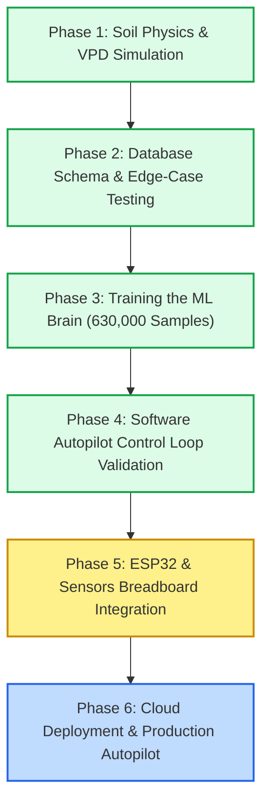
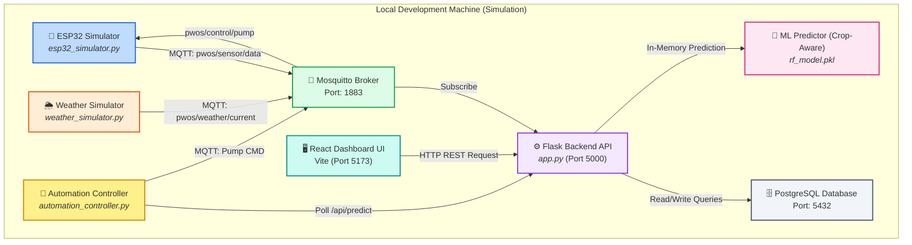
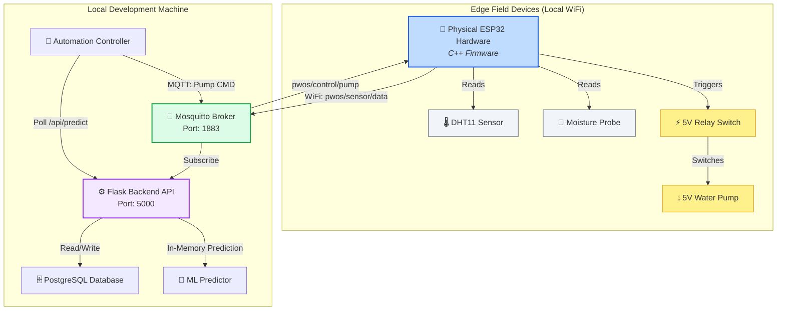
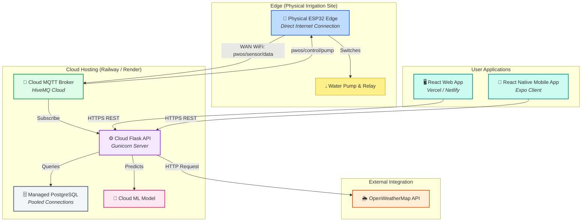

# 📐 System Architectures & Development Process

The Predictive Water Optimization System (P-WOS) was designed and implemented using a phased transition from virtual simulation to physical edge devices. The system architecture supports three distinct environments depending on the development and production stage.

---

## 🔄 The System Development Process

The project evolved through a structured six-stage pipeline, ensuring all software pipelines and control logic were fully tested before physical assembly:

1. **Simulation Phase**: Developed a math-based digital twin of the soil and plants to simulate moisture depletion and evaporation.
2. **Database Verification**: Pre-populated PostgreSQL tables with simulated data to test connection pooling and queries.
3. **ML Training**: Generated a dataset of 630,000 samples to train a Random Forest model.
4. **Control Loop Validation**: Verified the 5-second control loop, 15-minute cooldown, and weather delay rules entirely in software.
5. **Hardware Integration**: Built physical breadboard hardware and loaded C++ firmware to replace the simulated signals.
6. **Cloud Production**: Deployed the Flask API, PostgreSQL, and MQTT broker to cloud servers for remote field operation.

---

## 📐 System Architectures

### 1. Development Architecture (Simulation-First)
Used during initial development. All hardware, telemetry, and atmospheric weather updates are fully simulated in local processes.

### 2. Development Architecture (Real Hardware)
Used for physical breadboard assembly verification. The ESP32 simulator is replaced by the real physical ESP32 micro-controller, transmitting sensor readings over local WiFi to the Mosquitto broker.

### 3. Production Architecture (Cloud Deployment)
The final production architecture. The backend, database, and broker are deployed to cloud infrastructure (such as Railway or Render). The physical ESP32 communicates securely with the cloud broker over WAN (cellular/router WiFi), and the user accesses the live React interface and mobile application remotely.

