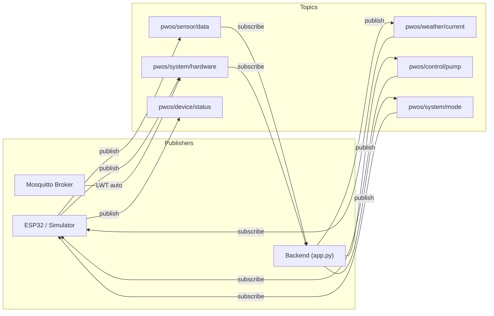

# MQTT Topics Reference

**P-WOS MQTT Communication Protocol**

All components communicate via Mosquitto MQTT broker (default: `localhost:1883`).

---

## Topic Map



---

## Topic Details

### `pwos/sensor/data`
**Direction:** ESP32 → Backend  
**Format:** JSON  
**QoS:** 0  
**Retain:** No  
**Interval:** Every 5 seconds

```json
{
    "device_id": "ESP32_PWOS_001",
    "timestamp": 5130,
    "soil_moisture": 45.5,
    "temperature": 25.3,
    "humidity": 60.2,
    "pump_active": false
}
```

| Field | Type | Range | Notes |
|-------|------|-------|-------|
| `device_id` | string | — | Hardware: `ESP32_PWOS_001`, Simulator: `SIM_ESP32_001` |
| `timestamp` | int | millis | ESP32 uptime in milliseconds |
| `soil_moisture` | float | 0–100 | Percentage, calibrated from ADC |
| `temperature` | float | -50–60 | Celsius from DHT11 |
| `humidity` | float | 0–100 | Relative humidity from DHT11 |
| `pump_active` | bool | — | Current pump relay state |

---

### `pwos/system/hardware`
**Direction:** ESP32 → Backend (with LWT)  
**Format:** Plain text  
**QoS:** 1  
**Retain:** **Yes**

| Payload | When Published | By |
|---------|----------------|-----|
| `ONLINE` | On MQTT connect | ESP32 firmware |
| `OFFLINE` | On unexpected disconnect | Mosquitto broker (LWT) |

> **Important:** This is a plain-text topic — the backend must **not** attempt `json.loads()` on this payload. The `on_message` handler processes this topic before JSON parsing.

**Backend handling:**
```python
if msg.topic == 'pwos/system/hardware':
    system_state['hardware_status'] = payload_str  # "ONLINE" or "OFFLINE"
    return  # Skip JSON parsing
```

---

### `pwos/device/status`
**Direction:** ESP32 → Backend  
**Format:** JSON  
**QoS:** 0  
**Retain:** No  
**Interval:** Every 30 seconds

```json
{
    "device_id": "ESP32_PWOS_001",
    "uptime": 12345,
    "free_heap": 180000,
    "rssi": -45,
    "pump_active": false,
    "wifi_reconnects": 0,
    "mqtt_reconnects": 0,
    "dht_errors": 0,
    "soil_errors": 0
}
```

---

### `pwos/weather/current`
**Direction:** Backend → ESP32  
**Format:** JSON  
**QoS:** 0  
**Retain:** No  
**Interval:** Every 60 seconds

```json
{
    "forecast_minutes": 5448,
    "forecast_temp": 16.17,
    "forecast_humidity": 63,
    "wind_speed": 11.8,
    "precipitation_chance": 0,
    "rain_intensity": 0.0,
    "cloud_cover": 0,
    "condition": "Clear",
    "source": "openweathermap",
    "timestamp": "2026-04-11T22:11:38.203634"
}
```

| Field | Type | Notes |
|-------|------|-------|
| `source` | string | `"openweathermap"`, `"simulation"`, or `"fallback"` |
| `forecast_minutes` | int | Minutes until next rain event (0 = no rain expected) |
| `rain_intensity` | float | Current rain intensity (0–100 scale) |
| `wind_speed` | float | Wind speed in km/h |

---

### `pwos/control/pump`
**Direction:** Backend → ESP32  
**Format:** JSON  
**QoS:** 1  
**Retain:** No

```json
{
    "action": "ON",
    "duration": 30
}
```

| Field | Type | Values | Notes |
|-------|------|--------|-------|
| `action` | string | `"ON"`, `"OFF"` | Pump command |
| `duration` | int | 1–120 | Seconds (only used with ON) |

---

### `pwos/system/mode`
**Direction:** Bidirectional (Backend ↔ ESP32)  
**Format:** Plain text  
**QoS:** 1  
**Retain:** **Yes**

| Payload | Meaning |
|---------|---------|
| `AUTO` | Backend controls pump via ML predictions |
| `MANUAL` | User controls pump via dashboard |

> **Important:** Like `pwos/system/hardware`, this is a plain-text topic — must not be parsed as JSON.

---

## Message Routing in Backend

The `on_message` handler in `app.py` uses a two-phase routing strategy:

### Phase 1: Plain-Text Topics (processed first)
```python
if msg.topic == 'pwos/system/mode':
    system_state['mode'] = payload_str  # "AUTO" / "MANUAL"
    return

if msg.topic == 'pwos/system/hardware':
    system_state['hardware_status'] = payload_str  # "ONLINE" / "OFFLINE"
    return
```

### Phase 2: JSON Topics (parsed via json.loads)
```python
data = json.loads(payload_str)  # Only runs for sensor/weather topics

if msg.topic == 'pwos/sensor/data':
    # Update latest_sensor_data, log to PostgreSQL

if msg.topic == 'pwos/weather/current':
    # Update weather data for ML predictions
```

This prevents `json.loads()` from crashing on plain-text payloads like `ONLINE` or `AUTO`.

---

## Debugging MQTT

### Monitor all topics
```bash
mosquitto_sub -h localhost -t "pwos/#" -v
```

### Monitor specific topic
```bash
# Watch sensor data
mosquitto_sub -h localhost -t "pwos/sensor/data"

# Watch hardware status
mosquitto_sub -h localhost -t "pwos/system/hardware"
```

### Publish test message
```bash
# Simulate sensor data
mosquitto_pub -h localhost -t "pwos/sensor/data" -m "{\"soil_moisture\":45.5,\"temperature\":25.0,\"humidity\":60.0}"

# Set hardware online
mosquitto_pub -h localhost -t "pwos/system/hardware" -m "ONLINE" -r

# Send pump command
mosquitto_pub -h localhost -t "pwos/control/pump" -m "{\"action\":\"ON\",\"duration\":10}"
```

### Clear retained messages
```bash
# Clear a specific retained message
mosquitto_pub -h localhost -t "pwos/system/hardware" -n -r
```
