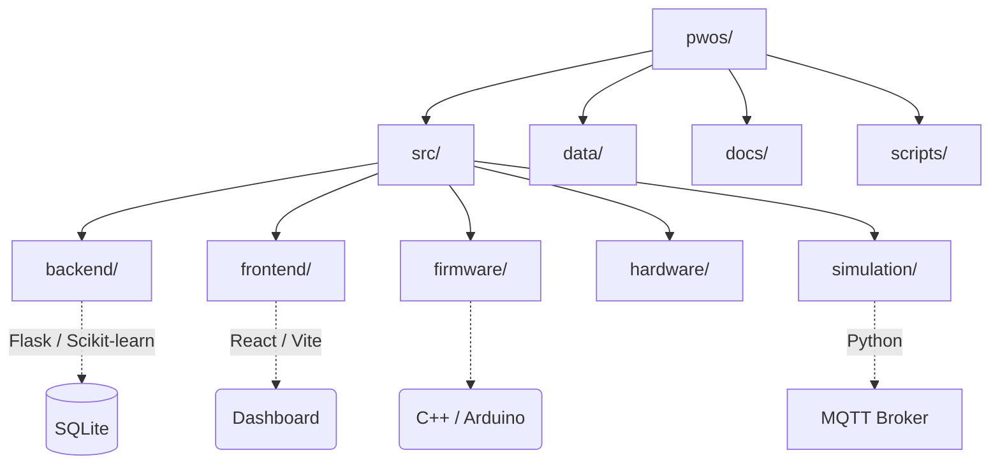

# Codebase Analysis: P-WOS (Predictive Watering Optimization System)

Based on a high-level review of the project directory structure, `README.md`, and core modules, here is an analysis of the P-WOS codebase.

## 🎯 Project Overview
P-WOS is a **Smart Irrigation Digital Twin with Machine Learning Control** designed to optimize agricultural or residential watering. It aims to reduce water consumption by leveraging predictive machine learning models rather than reactive, threshold-based watering schedules. 

The system operates across several tiers, including a physical/simulated edge device (ESP32), a message broker (MQTT), a Python backend running AI/ML inferences, and a React frontend for real-time monitoring and control.

---

## 🏛️ System Architecture & Tech Stack

### 1. Edge / IoT Layer (`src/firmware`, `src/hardware`, `src/simulation`)
*   **Firmware & Hardware**: Code for real ESP32 microcontrollers. Handles sensor reading (soil moisture, etc.) and pump actuation. Includes serial bridges for local communication.
*   **Simulation**: When hardware is unavailable, the system runs a software digital twin (`esp32_simulator.py`) which publishes mock sensor data. It includes a `weather_simulator.py` to generate realistic environmental parameters like VPD (Vapor Pressure Deficit) and simulate rainfall.

### 2. Messaging Layer (`Mosquitto`)
*   The project utilizes **MQTT (Mosquitto)** to enable real-time, lightweight communication between the IoT devices (or simulators) and the backend API. The backend listens to sensor telemetry topics and publishes control commands.

### 3. Backend & ML Layer (`src/backend`)
*   **Tech Stack**: Python (3.13+), Flask, SQLite, Scikit-Learn (`sklearnex` for Intel iGPU acceleration)
*   **Core Responsibilities**:
    *   **Flask API (`app.py`)**: Exposes REST endpoints for the frontend.
    *   **MQTT Subscriber (`mqtt_subscriber.py`)**: Intercepts real-time data from the edge devices and logs it to `database.py`.
    *   **Automation Controller & Scheduler**: Interprets incoming sensor values to trigger watering. 
    *   **AI/ML Service (`ai_service/`)**: Houses a Random Forest ML model trained on historical data with 17 features. The model leverages external weather forecasting (`weather_api.py`) to preemptively decide if watering is needed or if rainfall will suffice.

### 4. Frontend Layer (`src/frontend`)
*   **Tech Stack**: React 19, Vite, TypeScript, Tailwind CSS
*   **UI Components**: Utilizes `@radix-ui` primitives, `lucide-react` for icons, `framer-motion` for animations, and `chart.js` / `recharts` for data visualization.
*   **Core Responsibilities**: Provides a real-time dashboard displaying system health, predicted vs. actual soil moisture, water consumption metrics, and manual overrides.

---

## 📁 Directory Structure Breakdown

### Notable Subdirectories
*   **`src/backend/`**: Contains the `app.py` web server setup, `models/` for saved ML models, `ai_service/` for ML predictions, and `weather_api.py`.
*   **`src/frontend/`**: Contains the React dashboard. It relies on Vite as a bundler and Playwright (`e2e/`) / Vitest for testing.
*   **`data/`**: Used for storing raw/processed datasets for ML model training, historical sensor data, and calibration information. 
*   **`docs/`**: Includes detailed architectural reference materials (e.g., `API_REFERENCE.md`, `DATABASE_GUIDE.md`, etc.).

---

## 🔍 Key Observations & Execution

1.  **A/B Testing Native**: The system specifically embeds logic to test water savings against a baseline hypothesis (validated at 16.7% savings in your simulation runs). 
2.  **Hardware & Software Bridging**: The repository is set up gracefully so that users can replace the simulated Python ESP32 script with actual microcontroller hardware with almost zero friction (just swapping MQTT targets or using the `serial_bridge`).
3.  **Clean Separation of Concerns**: By using MQTT as a middleman, the heavy AI workloads (Random Forest in Python) are cleanly decoupled from the edge devices, preventing performance constraints on the microcontroller.
